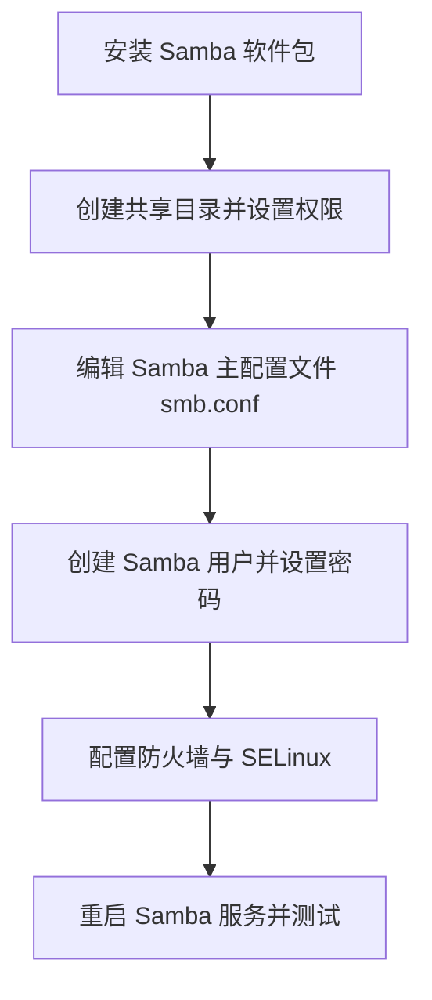

# Samba

Samba 是一个开源的软件套件，它允许 Linux 系统与 Windows 系统之间实现文件共享与打印服务。下面我为你梳理一下 Samba 的配置流程和关键注意事项。

## 配置步骤



## 安装 Samba 软件包

首先，确保系统已更新，然后安装 Samba。命令因发行版而异：

-   **Debian/Ubuntu 系统**：
    ```bash
    sudo apt update
    sudo apt install samba -y
    ```

-   **RHEL/CentOS/Fedora 系统**：
    ```bash
    # 对于 CentOS 7 等使用 yum 的系统
    sudo yum install samba samba-client samba-common -y
    # 或者对于使用 dnf 的新版本系统
    sudo dnf install samba -y
    ```

安装后，验证安装是否成功：
```bash
smbd --version
```

## 创建共享目录并设置权限

需要一个打算共享出去的目录。

```bash
sudo mkdir -p /srv/samba/shared  # 创建目录，-p 确保即使上级目录不存在也一并创建
```
接着，**正确设置目录的权限**至关重要，这决定了谁能访问以及能做什么：
```bash
sudo chmod -R 0775 /srv/samba/shared  # 设置目录权限，允许所有者和组读写执行，其他用户读和执行
sudo chown -R nobody:nogroup /srv/samba/shared  # 将目录所有者和组设置为 nobody 和 nogroup
```
*   **权限说明**：`chmod -R 0775` 中的 `-R` 表示递归处理目录下的所有文件和子目录。`0775` 表示：
    *   **所有者 (owner)**：读、写、执行 (7)
    *   **所属组 (group)**：读、写、执行 (7)
    *   **其他用户 (others)**：读、执行 (5)
*   `chown -R nobody:nogroup` 将目录的所有者和组设置为系统低权限用户 `nobody` 和组 `nogroup`，常用于匿名或共享访问，但**更安全的做法是将其分配给一个特定的属组**（例如 `chown -R :smbgroup /srv/samba/shared`），然后只将允许访问的用户加入该组。

## 编辑 Samba 主配置文件 `/etc/samba/smb.conf`

在修改前，**建议先备份**原始配置文件：
```bash
sudo cp /etc/samba/smb.conf /etc/samba/smb.conf.bak
```

然后用文本编辑器（如 `nano` 或 `vim`）打开配置文件：
```bash
sudo nano /etc/samba/smb.conf
```

在 `smb.conf` 文件中，你需要配置**全局设置**和**共享定义**：

-   **全局设置 [global]**：通常位于文件开头，用于设置整个 Samba 服务器的行为。
    ```ini
    [global]
       workgroup = WORKGROUP        # 设置工作组，通常与 Windows 的工作组一致
       security = user              # 使用用户认证，这是推荐的安全设置
       server string = Samba Server # 服务器描述
       # 日志设置
       log file = /var/log/samba/log.%m  # 定义日志文件位置，%m 代表客户端机器名
       max log size = 1000               # 单个日志文件最大大小（KB）
    ```
    *   `security = user` 表示需要用户名和密码才能访问。

-   **共享定义**：在文件末尾添加，定义你要共享的具体目录。
    ```ini
    [MyShare]                    # 共享名称，客户端看到的名称
       comment = My Shared Folder   # 共享描述
       path = /srv/samba/shared     # 共享目录的实际路径
       browsable = yes              # 允许在网络中浏览此共享
       read only = no               # 是否只读，no 表示可读写
       writable = yes               # 等同于 read only = no
       guest ok = no                # 是否允许匿名访问，no 表示需要认证
       valid users = @smbgroup      # 允许访问的用户或组（@表示组）
       create mask = 0664           # 新创建文件的默认权限
       directory mask = 0775        # 新创建目录的默认权限
    ```
    *   请确保 `path` 的路径与你创建的共享目录一致。
    *   `valid users` 可以指定具体的用户名（如 `user1`），也可以用 `@组名` 指定一个组的所有成员。
    *   `create mask` 和 `directory mask` 控制了在共享目录中新建文件和目录时的默认权限。

## 创建 Samba 用户并设置密码

Samba 有自己独立的用户数据库，系统用户需要被添加到 Samba 中并设置密码后才能访问 Samba 共享。

1.  **确保系统用户存在**：如果 `valid users` 中指定的用户尚未在系统中存在，需要先创建（建议使用 `-s /sbin/nologin` 禁止该用户登录系统）：
    ```bash
    sudo useradd -M -s /sbin/nologin smbuser  # -M 不创建家目录，-s 指定登录shell
    ```

2.  **将用户添加到 Samba 数据库并设置密码**：
    ```bash
    sudo smbpasswd -a smbuser  # 将用户 smbuser 添加到 Samba 数据库
    ```
    执行后会提示你输入密码。**这个密码是客户端访问共享时输入的密码**，可以与系统登录密码不同。

    如果 `valid users` 指定了组（如 `@smbgroup`），则需要先创建组，将用户加入该组，并设置目录的组所有权：
    ```bash
    sudo groupadd smbgroup           # 创建用户组
    sudo usermod -aG smbgroup smbuser # 将用户添加到组
    sudo chgrp -R smbgroup /srv/samba/shared # 将共享目录的所属组改为 smbgroup
    # 还可以再调整一下目录权限，确保组有写权限
    sudo chmod -R g+w /srv/samba/shared
    ```

## 配置防火墙与 SELinux

-   **防火墙设置**：需要放行 Samba 相关流量。
    
    -   如果使用 `firewalld`（CentOS/RHEL）：
        ```bash
        sudo firewall-cmd --permanent --add-service=samba
        sudo firewall-cmd --reload
        ```
    -   如果使用 `ufw`（Ubuntu/Debian）：
        ```bash
        sudo ufw allow samba
        ```
    
-   **SELinux 设置**（仅限启用 SELinux 的系统，如 CentOS/RHEL）：
    ```bash
    sudo chcon -t samba_share_t /srv/samba/shared  # 设置共享目录的 SELinux 安全上下文
    sudo setsebool -P samba_enable_home_dirs on    # 如果需要共享家目录，启用相关布尔值
    # 更宽松的设置（谨慎使用）
    # sudo setsebool -P samba_export_all_rw=1
    ```

## 重启 Samba 服务并测试配置

1.  **重启服务**以使新配置生效：
    -   Debian/Ubuntu：
        ```bash
        sudo systemctl restart smbd nmbd
        ```
    -   RHEL/CentOS：
        ```bash
        sudo systemctl restart smb nmb
        ```
        **建议启用开机自启**：
    ```bash
    sudo systemctl enable smb nmb  # 或者 smbd nmbd
    ```

2.  **检查配置语法**有无错误：
    ```bash
    testparm
    ```

3.  **客户端测试访问**：
    -   **Windows**：在文件资源管理器地址栏输入 `\\你的服务器IP\MyShare`（如 `\\192.168.1.100\MyShare`），按回车后输入用户名密码。
    -   **Linux**：可以使用 `smbclient` 命令：
        ```bash
        smbclient //服务器IP/MyShare -U smbuser
        ```
        或者挂载使用：
        ```bash
        sudo mount -t cifs //服务器IP/MyShare /mnt -o username=smbuser
        ```
    -   **macOS**：在 Finder 中选择“前往”->“连接服务器”，输入 `smb://服务器IP/MyShare`。

## Samba 权限管理深度解析

配置 Samba 时，理解并妥善处理权限至关重要，因为它直接关系到安全和可用性。Samba 权限可以看作一个“双层滤网”：

| 权限层                         | 控制者              | 作用                                                         | 常用命令/配置                                        |
| :----------------------------- | :------------------ | :----------------------------------------------------------- | :--------------------------------------------------- |
| **第一层：Linux 文件系统权限** | Linux 系统          | 决定了**系统用户/组**对文件和目录的**基本操作权限**（读、写、执行）。这是 Samba 权限的基础，Samba 无法超越它。 | `chmod`, `chown`, `chgrp`                            |
| **第二层：Samba 共享权限**     | `smb.conf` 中的参数 | 在 Linux 权限的基础上，进一步控制 **Samba 客户端用户** 对**共享**的访问方式。 | `writable`, `read only`, `valid users`, `write list` |

**两者关系**：Samba 客户端用户最终享有的有效权限，是 **Samba 共享权限** 和 **Linux 文件系统权限** 的**交集**。例如，即使用户在 `smb.conf` 中被赋予了 `writable = yes`，但如果该用户在 Linux 系统上对共享目录没有写权限，那么他依然无法写入。

**最佳实践建议**：
*   **权限细化**：使用 `write list` 参数可以更精细地控制，例如 `write list = @smbadmin`，这样即使共享本身 `writable = yes`，也只有 `smbadmin` 组的成员才能写入，其他用户只读。
*   **权限一致性**：确保 `smb.conf` 中 `valid users` 指定的用户或组，在 Linux 系统上对共享目录（`path` 指定的路径）拥有相应的文件系统权限。
*   **掩码使用**：利用 `create mask` 和 `directory mask` 可以明确规定在共享中新建文件和目录时的默认权限，保证安全性和一致性。

## 配置注意事项

1.  **安全建议**：
    *   **避免使用 `guest ok = yes`**：除非你确实需要完全匿名访问，否则应要求用户认证。
    *   **使用最小权限原则**：只给用户分配他们必需的最小权限。
    *   **考虑禁用旧协议**：在 `[global]` 部分添加 `server min protocol = SMB2` 以禁用不安全的 SMBv1。
    *   **定期更新**：保持 Samba 软件包更新，以获取安全补丁。

2.  **故障排查**：
    *   **仔细检查日志**：日志文件（如 `/var/log/samba/log.%m`）是排查问题的第一去处。
    *   **确认防火墙和 SELinux**：大部分连接问题与防火墙阻塞或 SELinux 限制有关。
    *   **双重检查权限**：确保 Linux 文件系统权限和 Samba 配置权限设置正确且一致。
    *   **使用 `testparm`**：在重启服务前，总是用 `testparm` 检查配置文件语法。

3.  **性能调优**（可选）：
    对于大文件传输或高并发访问，可以在 `[global]` 部分考虑添加：
    ```ini
    socket options = TCP_NODELAY SO_RCVBUF=131072 SO_SNDBUF=131072
    read raw = yes
    write raw = yes
    ```

