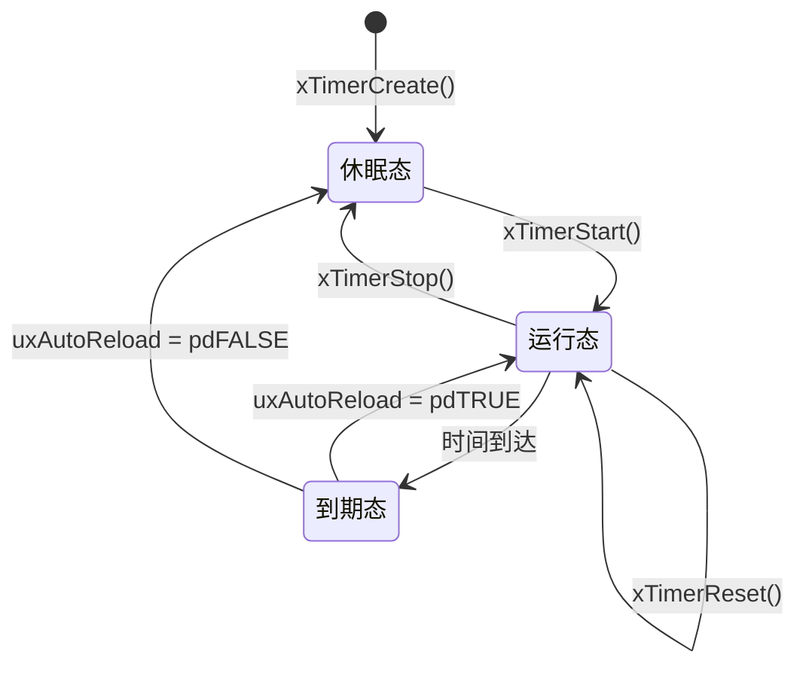

## 定时器系统架构

### 核心组件

```c
// 定时器控制块结构（简化）
typedef struct tmrTimerControl {
    const char *pcTimerName;          // 定时器名称
    ListItem_t xTimerListItem;        // 定时器链表项
    TickType_t xTimerPeriodInTicks;   // 定时周期（节拍数）
    UBaseType_t uxAutoReload;         // 自动重载标志
    TimerCallbackFunction_t pxCallbackFunction; // 回调函数
    void *pvTimerID;                  // 定时器ID
} xTIMER;
```

### 系统组成

1. **定时器服务任务** - 专门处理定时器的任务
2. **定时器命令队列** - 用于向服务任务发送命令
3. **定时器链表** - 按到期时间排序的定时器列表

## ⚙️ 工作原理

### 1. 定时器服务任务

```c
// 定时器服务任务的主循环
void prvTimerTask( void *pvParameters )
{
    TickType_t xNextExpireTime;
    BaseType_t xListWasEmpty;
    
    for( ;; ) {
        // 获取下一个定时器的到期时间
        xNextExpireTime = prvGetNextExpireTime( &xListWasEmpty );
        
        // 处理定时器到期事件
        prvProcessTimerOrBlockTask( xNextExpireTime, xListWasEmpty );
        
        // 处理定时器命令队列
        prvProcessReceivedCommands();
    }
}
```

### 2. 定时器状态管理



## 🔧 核心 API 函数

### 1. 创建定时器

```c
TimerHandle_t xTimerCreate( const char * const pcTimerName,
                           const TickType_t xTimerPeriodInTicks,
                           const UBaseType_t uxAutoReload,
                           void * const pvTimerID,
                           TimerCallbackFunction_t pxCallbackFunction );
```

**参数说明：**

- `pcTimerName` - 定时器名称（调试用）
- `xTimerPeriodInTicks` - 定时周期（系统节拍数）
- `uxAutoReload` - 自动重载（pdTRUE-周期，pdFALSE-单次）
- `pvTimerID` - 定时器标识符
- `pxCallbackFunction` - 回调函数

### 2. 启动定时器

```c
// 在任务中启动
BaseType_t xTimerStart( TimerHandle_t xTimer, TickType_t xTicksToWait );

// 在中断中启动
BaseType_t xTimerStartFromISR( TimerHandle_t xTimer, 
                              BaseType_t *pxHigherPriorityTaskWoken );
```

### 3. 其他操作函数

```c
// 停止定时器
BaseType_t xTimerStop( TimerHandle_t xTimer, TickType_t xTicksToWait );

// 重置定时器（重新开始计时）
BaseType_t xTimerReset( TimerHandle_t xTimer, TickType_t xTicksToWait );

// 改变定时周期
BaseType_t xTimerChangePeriod( TimerHandle_t xTimer, 
                              TickType_t xNewPeriod, 
                              TickType_t xTicksToWait );
```

## 📋 配置要求

在 `FreeRTOSConfig.h` 中必须配置：

```c
#define configUSE_TIMERS                 1   // 启用定时器功能
#define configTIMER_TASK_PRIORITY        ( configMAX_PRIORITIES - 1 )  // 服务任务优先级
#define configTIMER_QUEUE_LENGTH         10  // 定时器命令队列长度
#define configTIMER_TASK_STACK_DEPTH     ( configMINIMAL_STACK_SIZE * 2 )  // 任务堆栈
```

## 💻 使用示例

### 基本定时器使用

```c
// 定时器回调函数
void vTimerCallback( TimerHandle_t xTimer )
{
    static uint32_t ulExecutionCount = 0;
    ulExecutionCount++;
    
    // 获取定时器ID
    uint32_t *pulTimerID = ( uint32_t * ) pvTimerGetTimerID( xTimer );
    
    printf("Timer %ld callback executed %lu times\n", *pulTimerID, ulExecutionCount);
}

// 创建和启动定时器
void setup_timers(void)
{
    TimerHandle_t xAutoReloadTimer, xOneShotTimer;
    uint32_t ulAutoReloadTimerID = 1, ulOneShotTimerID = 2;
    
    // 创建自动重载定时器（周期500ms）
    xAutoReloadTimer = xTimerCreate(
        "AutoReloadTimer",
        pdMS_TO_TICKS(500),    // 500ms
        pdTRUE,                // 自动重载
        (void *)&ulAutoReloadTimerID,
        vTimerCallback
    );
    
    // 创建单次定时器
    xOneShotTimer = xTimerCreate(
        "OneShotTimer",
        pdMS_TO_TICKS(1000),   // 1000ms
        pdFALSE,               // 单次
        (void *)&ulOneShotTimerID,
        vTimerCallback
    );
    
    // 启动定时器
    if (xAutoReloadTimer != NULL) {
        xTimerStart(xAutoReloadTimer, 0);
    }
    if (xOneShotTimer != NULL) {
        xTimerStart(xOneShotTimer, 0);
    }
}
```

## ⚠️ 重要注意事项

### 1. 回调函数限制

```c
void vTimerCallback( TimerHandle_t xTimer )
{
    // ✅ 允许的操作：
    // - 发送信号量/消息队列
    // - 修改全局变量
    // - 设置事件标志
    
    // ❌ 禁止的操作：
    // - vTaskDelay() 等阻塞调用
    // - 可能引起任务切换的API
    // - 长时间运行的操作
}
```

### 2. 性能特性

| 特性         | 说明                                         |
| ------------ | -------------------------------------------- |
| **精度**     | 依赖于系统节拍频率，通常为1ms的整数倍        |
| **开销**     | 需要额外的RAM和CPU资源（服务任务）           |
| **实时性**   | 回调函数在定时器服务任务上下文中执行，非实时 |
| **数量限制** | 理论上无限制，实际受内存限制                 |

### 3. 最佳实践

```c
// 在中断服务程序中使用定时器
void vAnInterruptServiceRoutine( void )
{
    BaseType_t xHigherPriorityTaskWoken = pdFALSE;
    
    // 从ISR中启动/停止/重置定时器
    xTimerStartFromISR( xTimer, &xHigherPriorityTaskWoken );
    
    // 如果需要，进行任务切换
    portYIELD_FROM_ISR( xHigherPriorityTaskWoken );
}
```

FreeRTOS 定时器提供了一种灵活的时间管理机制，特别适合需要周期性执行或延迟执行的应用场景，但需要注意其执行上下文和资源消耗。

