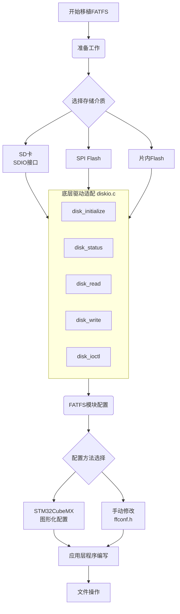

# FATFS文件系统在MUC中的配置

## FATFS文件系统配置

### 1. 获取FATFS源码
首先需要获取FATFS文件系统：
- 从[elm-chan官网](http://elm-chan.org/fsw/ff/00index_e.html)下载最新版本
- 或使用STM32CubeMX自动生成

### 2. 项目文件结构
```
YourProject/
├── FatFs/
│   ├── ffconf.h    # 配置文件
│   ├── ff.h        # 头文件
│   ├── ff.c        # 核心文件
│   ├── diskio.h    # 磁盘IO头文件
│   └── diskio.c    # 磁盘IO实现
├── Drivers/
│   └── SDIO/       # SDIO驱动
└── Src/
    └── main.c
```

### 3. FATFS配置文件 (ffconf.h)

```c
#ifndef _FFCONF
#define _FFCONF

#include "stm32f4xx.h"

// 主要配置选项
#define _FFCONF 88300

// 系统配置
#define _FS_TINY             0      // 0:标准模式，1:微小模式（用于RAM小的系统）
#define _FS_READONLY         0      // 0:读写模式，1:只读模式
#define _FS_MINIMIZE         0      // 功能最小化级别 0-3
#define _USE_STRFUNC         1      // 1:支持字符串操作
#define _USE_MKFS            1      // 1:启用格式化功能
#define _USE_FASTSEEK        1      // 1:启用快速定位
#define _USE_LABEL           1      // 1:支持卷标
#define _USE_FORWARD         0      // 1:支持f_forward函数

// 编码配置
#define _CODE_PAGE           936    // 简体中文(936)，英文为437
#define _USE_LFN             2      // 长文件名支持 0:关闭,1:静态缓冲,2:动态缓冲
#define _MAX_LFN             255    // 最大长文件名长度
#define _LFN_UNICODE         0      // 0:ANSI/OEM, 1:Unicode

// 驱动器/卷配置
#define _VOLUMES             1      // 逻辑驱动器数量
#define _STR_VOLUME_ID       0      // 0:数字卷ID，1:字符串卷ID
#define _VOLUME_STRS         "RAM","NAND","CF","SD1","SD2","USB"
#define _MULTI_PARTITION     0      // 0:单分区，1:多分区

// 扇区配置
#define _MIN_SS              512    // 最小扇区大小
#define _MAX_SS              512    // 最大扇区大小
#define _USE_TRIM            0      // 1:启用ATA-TRIM

// 系统接口
#define _FS_REENTRANT        0      // 0:非重入，1:重入（多任务）
#define _FS_TIMEOUT          1000   // 超时时间（单位：ticks）
#define _SYNC_t              HANDLE // 同步对象类型

// 字节序
#define _WORD_ACCESS         0      // 0:字节访问，1:字访问

#endif
```

### 4. 磁盘IO接口实现 (diskio.c)

这是连接FATFS和硬件SDIO驱动的关键文件：

```c
#include "diskio.h"
#include "ff.h"
#include "stm32f4xx.h"

// SD卡状态
static volatile DSTATUS Stat = STA_NOINIT;

// 获取磁盘状态
DSTATUS disk_status(BYTE pdrv)
{
    if (pdrv != 0) return STA_NOINIT;  // 只支持驱动器0
    
    return Stat;
}

// 初始化磁盘
DSTATUS disk_initialize(BYTE pdrv)
{
    if (pdrv != 0) return STA_NOINIT;
    
    // 如果SD卡已经初始化过，直接返回
    if ((Stat & STA_NOINIT) == 0) {
        return Stat;
    }
    
    // 调用SDIO初始化函数（需要您实现）
    if (SD_Init() == SD_OK) {
        Stat &= ~STA_NOINIT;  // 清除未初始化标志
    } else {
        Stat = STA_NOINIT;    // 设置未初始化标志
    }
    
    return Stat;
}

// 读扇区
DRESULT disk_read(BYTE pdrv, BYTE *buff, LBA_t sector, UINT count)
{
    if (pdrv != 0) return RES_PARERR;
    if (Stat & STA_NOINIT) return RES_NOTRDY;
    
    // 调用SDIO读函数（需要您实现）
    if (SD_ReadBlocks((uint32_t*)buff, sector, count, SDIO_TIMEOUT) == SD_OK) {
        // 等待读操作完成
        if (SD_WaitReadOperation() == SD_OK) {
            while (SD_GetStatus() != SD_TRANSFER_OK);
        }
        return RES_OK;
    }
    
    return RES_ERROR;
}

// 写扇区  
DRESULT disk_write(BYTE pdrv, const BYTE *buff, LBA_t sector, UINT count)
{
    if (pdrv != 0) return RES_PARERR;
    if (Stat & STA_NOINIT) return RES_NOTRDY;
    
    // 调用SDIO写函数（需要您实现）
    if (SD_WriteBlocks((uint32_t*)buff, sector, count, SDIO_TIMEOUT) == SD_OK) {
        // 等待写操作完成
        if (SD_WaitWriteOperation() == SD_OK) {
            while (SD_GetStatus() != SD_TRANSFER_OK);
        }
        return RES_OK;
    }
    
    return RES_ERROR;
}

// 磁盘控制
DRESULT disk_ioctl(BYTE pdrv, BYTE cmd, void *buff)
{
    if (pdrv != 0) return RES_PARERR;
    if (Stat & STA_NOINIT) return RES_NOTRDY;
    
    DRESULT res = RES_ERROR;
    SD_CardInfo CardInfo;
    
    switch (cmd) {
        case CTRL_SYNC:
            res = RES_OK;
            break;
            
        case GET_SECTOR_COUNT:
            if (SD_GetCardInfo(&CardInfo) == SD_OK) {
                *(LBA_t*)buff = CardInfo.CardCapacity / 512;
                res = RES_OK;
            }
            break;
            
        case GET_SECTOR_SIZE:
            *(WORD*)buff = 512;
            res = RES_OK;
            break;
            
        case GET_BLOCK_SIZE:
            *(DWORD*)buff = 1;  // 块大小（扇区数）
            res = RES_OK;
            break;
            
        default:
            res = RES_PARERR;
            break;
    }
    
    return res;
}

// 获取当前时间（用于文件时间戳）
DWORD get_fattime(void)
{
    // 返回FAT文件时间格式
    // 格式: bit31:25 - 年(0-127, 从1980开始)
    //       bit24:21 - 月(1-12)
    //       bit20:16 - 日(1-31)
    //       bit15:11 - 时(0-23)
    //       bit10:5  - 分(0-59)
    //       bit4:0   - 秒/2(0-29)
    
    // 示例: 2024年1月1日 12:00:00
    return ((2024 - 1980) << 25) | (1 << 21) | (1 << 16) | (12 << 11) | (0 << 5) | (0 >> 1);
}
```

### 5. 磁盘IO头文件 (diskio.h)

```c
#ifndef _DISKIO
#define _DISKIO

#include "integer.h"

// 状态定义
#define STA_NOINIT		0x01	// 驱动器未初始化
#define STA_NODISK		0x02	// 无介质
#define STA_PROTECT		0x04	// 写保护

// 命令定义
#define CTRL_SYNC			0	// 完成挂起的写入过程
#define GET_SECTOR_COUNT	1	// 获取扇区数
#define GET_SECTOR_SIZE		2	// 获取扇区大小
#define GET_BLOCK_SIZE		3	// 获取擦除块大小

// 函数原型
DSTATUS disk_initialize (BYTE pdrv);
DSTATUS disk_status (BYTE pdrv);
DRESULT disk_read (BYTE pdrv, BYTE* buff, LBA_t sector, UINT count);
DRESULT disk_write (BYTE pdrv, const BYTE* buff, LBA_t sector, UINT count);
DRESULT disk_ioctl (BYTE pdrv, BYTE cmd, void* buff);

#endif
```

## FATFS使用示例

### 6. 完整的文件操作函数

```c
#include "ff.h"
#include "diskio.h"

// 全局变量
FATFS fs;           // 文件系统对象
FIL file;           // 文件对象
FRESULT fr;         // 返回值
UINT bw, br;        // 读写字节数

// 初始化文件系统
uint8_t FATFS_Init(void)
{
    printf("初始化FATFS文件系统...\r\n");
    
    // 注册工作区（挂载驱动器）
    fr = f_mount(&fs, "", 1);  // 1:立即挂载
    if (fr != FR_OK) {
        printf("文件系统挂载失败: %d\r\n", fr);
        return 0;
    }
    
    printf("文件系统挂载成功\r\n");
    return 1;
}

// 测试SD卡和文件系统
void Test_SD_FATFS(void)
{
    char buffer[100];
    
    printf("\r\n=== SD卡和FATFS测试 ===\r\n");
    
    // 挂载文件系统
    if (!FATFS_Init()) {
        return;
    }
    
    // 创建测试文件
    fr = f_open(&file, "test.txt", FA_CREATE_ALWAYS | FA_WRITE);
    if (fr != FR_OK) {
        printf("文件创建失败: %d\r\n", fr);
        return;
    }
    
    // 写入数据
    char *data = "Hello, STM32F407 FATFS!\r\n";
    fr = f_write(&file, data, strlen(data), &bw);
    if ((fr != FR_OK) || (bw != strlen(data))) {
        printf("文件写入失败: %d\r\n", fr);
        f_close(&file);
        return;
    }
    
    printf("写入成功: %d 字节\r\n", bw);
    
    // 关闭文件
    fr = f_close(&file);
    if (fr != FR_OK) {
        printf("文件关闭失败: %d\r\n", fr);
        return;
    }
    
    // 重新打开文件读取
    fr = f_open(&file, "test.txt", FA_READ);
    if (fr != FR_OK) {
        printf("文件打开失败: %d\r\n", fr);
        return;
    }
    
    // 读取数据
    fr = f_read(&file, buffer, sizeof(buffer) - 1, &br);
    if (fr != FR_OK) {
        printf("文件读取失败: %d\r\n", fr);
        f_close(&file);
        return;
    }
    
    buffer[br] = '\0';  // 添加字符串结束符
    printf("读取内容: %s", buffer);
    printf("读取字节: %d\r\n", br);
    
    // 关闭文件
    f_close(&file);
    
    printf("测试完成!\r\n");
}

// 获取SD卡信息
void Get_SDCard_Info(void)
{
    FATFS *fs_ptr;
    DWORD free_clusters, total_sectors, free_sectors;
    FRESULT fr;
    
    // 获取空闲簇数量
    fr = f_getfree("", &free_clusters, &fs_ptr);
    if (fr != FR_OK) {
        printf("获取空闲空间失败: %d\r\n", fr);
        return;
    }
    
    // 计算总空间和空闲空间
    total_sectors = (fs_ptr->n_fatent - 2) * fs_ptr->csize;
    free_sectors = free_clusters * fs_ptr->csize;
    
    printf("SD卡信息:\r\n");
    printf("  总空间: %lu KB\r\n", total_sectors / 2);      // 扇区数/2 = KB
    printf("  空闲空间: %lu KB\r\n", free_sectors / 2);
    printf("  已用空间: %lu KB\r\n", (total_sectors - free_sectors) / 2);
}

// 列出目录内容
void List_Directory(const char* path)
{
    FRESULT fr;
    DIR dir;
    FILINFO fno;
    
    printf("目录列表: %s\r\n", path);
    
    fr = f_opendir(&dir, path);
    if (fr != FR_OK) {
        printf("打开目录失败: %d\r\n", fr);
        return;
    }
    
    while (1) {
        fr = f_readdir(&dir, &fno);
        if (fr != FR_OK || fno.fname[0] == 0) break;
        
        if (fno.fattrib & AM_DIR) {
            printf("  [DIR]  %s\r\n", fno.fname);
        } else {
            printf("  [FILE] %s (%lu bytes)\r\n", fno.fname, fno.fsize);
        }
    }
    
    f_closedir(&dir);
}
```

### 7. 在主函数中使用

```c
int main(void)
{
    // 系统初始化
    SystemInit();
    SysTick_Config(SystemCoreClock / 1000);
    USART_Init();
    
    printf("STM32F407 FATFS 测试程序\r\n");
    
    // 初始化SDIO
    SDIO_GPIO_Init();
    SDIO_Init();
    
    // 等待SD卡就绪
    Delay(1000);
    
    // 测试FATFS
    Test_SD_FATFS();
    
    // 获取SD卡信息
    Get_SDCard_Info();
    
    // 列出根目录
    List_Directory("");
    
    // 现在可以调用之前写的保存纯白图片函数
    SaveWhiteBMPToSD();
    
    while (1) {
        // 主循环
        Delay(1000);
    }
}
```

## 常见问题解决

### 8. 错误代码处理

```c
// FATFS错误代码解析
void Print_FATFS_Error(FRESULT fr)
{
    switch(fr) {
        case FR_OK: printf("操作成功\r\n"); break;
        case FR_DISK_ERR: printf("磁盘错误\r\n"); break;
        case FR_INT_ERR: printf("内部错误\r\n"); break;
        case FR_NOT_READY: printf("驱动器未就绪\r\n"); break;
        case FR_NO_FILE: printf("文件未找到\r\n"); break;
        case FR_NO_PATH: printf("路径未找到\r\n"); break;
        case FR_INVALID_NAME: printf("无效文件名\r\n"); break;
        case FR_DENIED: printf("访问被拒绝\r\n"); break;
        case FR_EXIST: printf("文件已存在\r\n"); break;
        case FR_INVALID_OBJECT: printf("无效对象\r\n"); break;
        case FR_WRITE_PROTECTED: printf("写保护\r\n"); break;
        case FR_INVALID_DRIVE: printf("无效驱动器\r\n"); break;
        case FR_NOT_ENABLED: printf("卷未挂载\r\n"); break;
        case FR_NO_FILESYSTEM: printf("无有效文件系统\r\n"); break;
        case FR_MKFS_ABORTED: printf("格式化被中止\r\n"); break;
        case FR_TIMEOUT: printf("超时\r\n"); break;
        case FR_LOCKED: printf("文件被锁定\r\n"); break;
        case FR_NOT_ENOUGH_CORE: printf("内存不足\r\n"); break;
        case FR_TOO_MANY_OPEN_FILES: printf("打开文件过多\r\n"); break;
        default: printf("未知错误: %d\r\n", fr); break;
    }
}
```

这样配置后，您的STM32F407就可以通过FATFS文件系统在SD卡上进行完整的文件操作了。记得先测试基本的文件读写功能，确保FATFS正常工作后再进行图片保存操作。


在STM32上使用FATFS文件系统，主要涉及**准备工作**、**底层驱动适配**、**FATFS组件配置**和**应用层API使用**这几个关键阶段。为了让你快速把握全局，下面这个流程图概括了主要的步骤和核心操作：



下面，我们分阶段来看看具体的操作和注意事项。

### 🔧 准备工作

1.  **获取FATFS源码**：从[FatFs官网](http://elm-chan.org/fsw/ff/00index_e.html)下载最新源码。解压后，重点关注 `source` 文件夹下的 `ff.c`, `ff.h`, `diskio.c`, `diskio.h`, `ffconf.h`。
2.  **选择存储介质**：根据你的硬件条件，FATFS可以支持SD卡（通过SDIO或SPI）、SPI Flash（如W25Q64）、甚至STM32的片内Flash。SD卡是较常见的选择。

### 📦 底层驱动与FATFS适配

这是移植的核心，主要工作是修改 `diskio.c` 文件，实现FATFS所需的底层存储介质操作接口。

#### 实现diskio.c中的函数

你需要根据选择的存储介质，在 `diskio.c` 中填充以下函数：

*   **`disk_initialize`**：初始化存储介质硬件。
*   **`disk_status`**：获取存储介质状态。
*   **`disk_read`**：从存储介质读取数据。
*   **`disk_write`**：向存储介质写入数据。
*   **`disk_ioctl`**：获取存储介质信息，如**扇区数量**(`GET_SECTOR_COUNT`)、**扇区大小**(`GET_SECTOR_SIZE`)等，这对FATFS正常工作至关重要。

#### 注意扇区地址转换

在 `disk_read` 和 `disk_write` 函数中，FATFS传递的是**逻辑扇区号**(LBA)。你需要根据实际存储介质的物理特性，将其转换为物理地址。例如，对于SPI Flash，通常需要将扇区号乘以扇区大小（如4096）来得到字节地址。

#### 提供时间戳函数

文件时间戳需要实时时钟(RTC)支持。若不需要准确的文件时间，可以返回一个固定值。在 `diskio.c` 中实现 `get_fattime` 函数即可。

### ⚙️ 配置FATFS模块

FATFS的功能通过 `ffconf.h` 文件进行配置。

#### 通过STM32CubeMX配置（推荐）

在Middleware中间件中选择FATFS，并启用你的存储介质（如SD卡）。你还可以方便地**开启长文件名支持**、选择**中文编码**等。CubeMX会自动根据你的配置生成代码并设置好堆栈大小。

#### 手动修改ffconf.h

若手动移植，需直接编辑 `ffconf.h`。主要配置项如下表：

| 配置宏         | 说明                                     | 常用设置             |
| :------------- | :--------------------------------------- | :------------------- |
| `_FS_READONLY` | 设置为只读文件系统                       | `0` (可读写)         |
| `_USE_MKFS`    | 使能格式化功能                           | `1` (使能)           |
| `_CODE_PAGE`   | 设置语言代码页，用于支持中文文件名       | `936` (简体中文)     |
| `_USE_LFN`     | 使能长文件名支持，注意这可能消耗较多内存 | `1`~`3`              |
| `_VOLUMES`     | 支持的最大逻辑驱动器数量                 | 根据实际设备数量设置 |
| `_MAX_SS`      | 扇区大小，设为512字节通常即可            | `512`                |

### 📝 编写应用层程序

配置好后，你就可以在应用程序中调用FATFS的API进行文件操作了。

1.  **挂载文件系统**：在对驱动器进行操作前，必须先使用 `f_mount` 挂载文件系统。
2.  **格式化（可选）**：若存储介质是首次使用或文件系统损坏，可使用 `f_mkfs` 进行格式化。
3.  **基本文件操作**：
    *   **打开/创建文件**：使用 `f_open`，使用 `FA_CREATE_ALWAYS` 等控制创建行为。
    *   **写入文件**：使用 `f_write`。
    *   **读取文件**：使用 `f_read`。
    *   **关闭文件**：完成文件操作后，务必使用 `f_close` 关闭文件。
4.  **错误处理**：FATFS的API会返回 `FRESULT` 类型的结果，建议在应用层检查这些返回值并进行相应处理。

### 💡 重要提示

*   **内存管理**：使能长文件名等功能可能会增加内存消耗，注意调整堆栈大小。
*   **驱动编号**：在 `diskio.c` 中，通过 `pdrv` 参数区分不同的物理驱动器，请确保为每个驱动器正确实现分支。
*   **SPI Flash的块大小**：SPI Flash通常有擦除块的概念，在 `disk_ioctl` 中通过 `GET_BLOCK_SIZE` 报告给FATFS，这对于 `f_mkfs` 很重要。

### ⌨️ 示例代码片段

这是一个简单的文件写入和读取流程：

```c
// 定义文件系统对象、文件对象、操作结果
FATFS fs;
FIL fil;
FRESULT fr;
UINT bw;

// 挂载文件系统
fr = f_mount(&fs, "0:", 1);
if (fr != FR_OK) {
    // 错误处理，如格式化
}

// 打开（或创建）文件并写入
fr = f_open(&fil, "0:test.txt", FA_CREATE_ALWAYS | FA_WRITE);
if (fr == FR_OK) {
    f_write(&fil, "Hello, FATFS!", 14, &bw);
    f_close(&fil);
}

// 重新打开文件并读取
char buffer[64];
fr = f_open(&fil, "0:test.txt", FA_READ);
if (fr == FR_OK) {
    f_read(&fil, buffer, sizeof(buffer), &bw);
    f_close(&fil);
    // 此时buffer中为读取的数据
}

// 不再使用时，卸载文件系统
f_mount(NULL, "0:", 0);
```

希望这份流程说明能帮助你在STM32上顺利使用FATFS。如果你在移植到特定存储介质（比如SD卡、SPI Flash等）时遇到具体困难，可以告诉我你使用的具体存储介质和芯片型号，我会尽力提供更详细的建议。