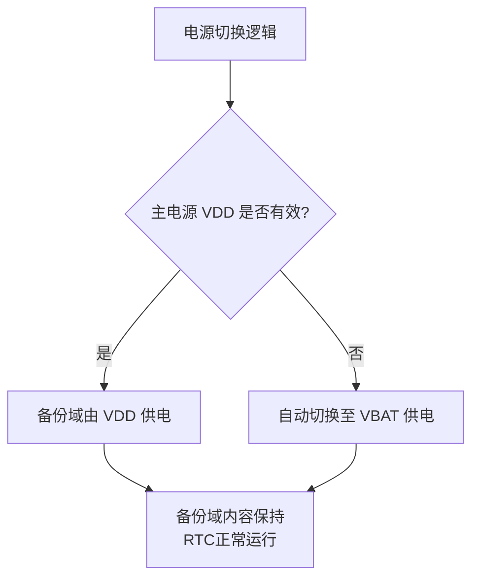

# VBAT供电

这是STM32备份域和低功耗运行的关键概念。

## VBAT是什么？

**VBAT**是STM32微控制器上的一个独立电源引脚，专门用于为芯片的**备份域**供电。当主电源消失时，STM32依然能依靠VBAT维持运转。


## VBAT的供电目标

VBAT引脚专门为**备份域**供电。备份域是芯片内部一个独立的电源区域，主要包括以下三个关键部分：

1.  **BKP备份寄存器**：我们刚刚讨论过的，用于在掉电时保存关键数据的寄存器。
2.  **RTC实时时钟**：即使主CPU停止，RTC也需要持续运行以保持准确的时间。
3.  **低速外部振荡器（LSE）**：通常为32.768kHz，为RTC提供高精度的时钟源。

**简单来说，VBAT的唯一任务就是确保在主电源断电时，上述三个部分能继续工作。**


## 电源切换机制

STM32内部有一个智能的电源切换电路，它根据VDD和VBAT的电压情况，自动选择为备份域供电的来源。其逻辑如下图所示：



这个自动切换机制是实现数据保持和无缝时间跟踪的核心。


## 如何连接VBAT？

VBAT的硬件连接方式直接决定了备份域功能的可靠性。主要有以下三种情况：

### **情况一：使用外部电池（典型用法）**

这是最标准、最可靠的用法。当系统主电源（VDD）断开时，由电池为备份域供电。

*   **连接方式**：将一个**3V的纽扣电池**（如CR2032）的正极连接到VBAT引脚，负极连接到GND。
*   **重要提示**：**强烈建议**在电池回路中串联一个**肖特基二极管**（如BAT54S）。这样可以防止当VDD上电时，电流反向流入电池，对其充电或造成损坏。
*   **应用场景**：需要长期保持时间、计数器或关键系统数据的设备，如智能电表、数据记录仪、安防设备等。


### **情况二：与VDD连接（低成本方案）**

如果应用不需要在主电源断电后保持备份域，或者设备始终不断电。

*   **连接方式**：用一个0Ω电阻或磁珠将**VBAT引脚直接连接到VDD（3.3V）**。
*   **优点**：节省电池成本。
*   **缺点**：一旦VDD断电，备份域的所有数据（RTC时间、BKP寄存器）都会丢失。
*   **应用场景**：消费类电子产品，如玩具、普通家电，断电后无需保持时间和数据。


### **情况三：不连接（禁止！）**

*   **行为**：如果VBAT引脚悬空，当VDD断电时，备份域将失去供电。这不仅会导致数据丢失，还可能在VDD上电时引发不可预知的行为，因为VBAT引脚的电平不确定。
*   **结论**：**VBAT引脚绝对不能悬空！** 如果不想用电池，就必须采用“情况二”的方式将其连接到VDD。


## VBAT模式下的功耗考虑

由于VBAT通常由容量有限的电池供电，了解备份域在此模式下的功耗至关重要。

*   **主要功耗来源**：
    1.  **RTC本身**：功耗极低，通常为几百纳安（nA）级别。
    2.  **LSE振荡器**：为RTC提供精确时钟，但也会消耗电流，通常为几百纳安到1微安（µA）左右。
    3.  **BKP备份寄存器**：本质是静态RAM，保持数据所需的功耗极低，可忽略不计。

*   **如何降低功耗**：
    *   如果只需要保持数据，而不需要精确计时，可以在进入VBAT模式前**关闭LSE振荡器**，使用功耗更低但精度较差的LSI（内部低速振荡器）或直接使用RTC的内置低功耗振荡器。这可以显著延长电池寿命。


## 软件配置要点

访问由VBAT供电的区域（如BKP寄存器、RTC）时，有一个关键步骤：

**使能备份域写访问（PWR_CR的DBP位）**
- 为了防止软件意外修改备份域的内容，STM32在上电复位后默认**禁止**对备份域的写操作。
- 在写RTC或BKP寄存器之前，必须先将电源控制寄存器（PWR_CR）中的**DBP（禁止备份域写保护）** 位置1。
- **代码示例（基于HAL库）:**
  ```c
  __HAL_RCC_PWR_CLK_ENABLE(); // 使能PWR时钟
  HAL_PWR_EnableBkUpAccess(); // 设置DBP位，允许写入备份域
  
  // 现在才可以配置RTC或写BKP寄存器
  HAL_RTCEx_BKUPWrite(&hrtc, RTC_BKP_DR0, 0x1234);
  ```

