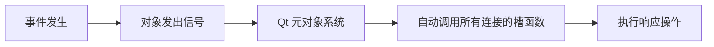

# 信号 槽 连接 

Qt 的信号槽（Signals & Slots）机制是其**核心通信机制**，用于实现对象间的松散耦合通信。它比传统回调函数更安全、更灵活，是 Qt 区别于其他框架的标志性特性。

## 核心概念
| **概念**           | **说明**                                                     | **示例**                                                     |
| ------------------ | ------------------------------------------------------------ | ------------------------------------------------------------ |
| **信号 (Signal)**  | 由对象在特定事件发生时**发出**的公告（如按钮点击、数据更新） | `void clicked()`                                             |
| **槽 (Slot)**      | 用于**响应信号**的普通成员函数（可属于任何 QObject 派生类）  | `void handleClick()`                                         |
| **连接 (Connect)** | 建立信号与槽的**绑定关系**（1个信号可连接多个槽，1个槽可响应多个信号） | `connect(btn, SIGNAL(clicked()), this, SLOT(handleClick()))` |

---

## 工作原理


## 关键特性

**类型安全（Qt5+新语法）**

```cpp
// 新语法（Qt5+，编译时检查 - 推荐！）
connect(btn, &QPushButton::clicked, this, &MyClass::handleClick);
```

**松散耦合**

- 发送方**无需知道**接收方是否存在
- 接收方**无需知道**信号来源
- 通过 `connect()`/`disconnect()` **动态管理连接**

**参数传递**

- 信号和槽的**参数必须兼容**（槽的参数数量 ≤ 信号的参数数量）
```cpp
// 信号带参数
void dataReceived(QByteArray data);  // 信号声明

// 槽接收参数
void processData(QByteArray data);   // 槽声明

// 连接（自动传递参数）
connect(serial, &QSerialPort::dataReceived, 
        this,   &MyApp::processData); // data 自动传递
```

**跨线程通信**

- 自动处理线程边界
- 通过**连接类型**控制行为：
  ```cpp
  connect(objA, &ClassA::signal, 
          objB, &ClassB::slot,
          Qt::QueuedConnection);  // 跨线程时使用队列方式
  ```

## 连接类型
| **连接类型**                   | **行为**                                     |
| ------------------------------ | -------------------------------------------- |
| `Qt::AutoConnection`           | 默认（同线程=直接调用，跨线程=队列调用）     |
| `Qt::DirectConnection`         | 立即在**发送者线程**调用槽                   |
| `Qt::QueuedConnection`         | 将调用加入**接收者线程事件队列**（异步安全） |
| `Qt::BlockingQueuedConnection` | 同步阻塞调用（慎用！）                       |
| `Qt::UniqueConnection`         | 防止重复连接（Qt5.15+）                      |

## 实际应用场景
**UI交互响应**

```cpp
// 按钮点击 → 关闭窗口
connect(ui->exitButton, &QPushButton::clicked, this, &QWidget::close);
//connect(发送者, 发送者的信号, 接收者, 接收者的槽);
```


```cpp
// 串口收到数据 → 解析数据
connect(serial, &QSerialPort::readyRead, this, &SerialHandler::parseData);
```


**自定义信号**

```cpp
class Worker : public QObject {
    Q_OBJECT
signals:
    void resultReady(int value);  // 自定义信号
public slots:
    void doWork() {
        // ...计算...
        emit resultReady(result); // 发出信号
    }
};
```


## 高级技巧

1. **Lambda 表达式作为槽**
   ```cpp
   connect(btn, &QPushButton::clicked, [=]() {
       qDebug() << "Button clicked!";
       ui->label->setText("Done");
   });
   ```

2. **信号连接信号**
   ```cpp
   // 按钮点击触发其他信号
   connect(btnA, &QPushButton::clicked, 
           btnB, &QPushButton::click);  // 注意：click() 是信号，不是槽！
   ```

3. **自动断开连接**
   ```cpp
   // 使用 QPointer 管理接收者生命周期
   QPointer<MyClass> receiver = new MyClass;
   connect(sender, &Sender::signal, receiver, &MyClass::slot);
   
   // 当 receiver 被删除时连接自动断开
   ```

---

## 七、与传统回调对比
| **特性**     | **信号槽**              | **回调函数**           |
| ------------ | ----------------------- | ---------------------- |
| 类型安全     | ✓ (Qt5+新语法)          | ✗ (常需 void* 强转)    |
| 松散耦合     | ✓ (对象无需相互引用)    | ✗ (需持有回调对象指针) |
| 多对多关系   | ✓                       | ✗                      |
| 跨线程安全性 | 内置支持                | 需手动同步             |
| 连接管理     | 自动断开(QObject销毁时) | 需手动注销             |

---

## 八、底层原理
1. **元对象系统 (Meta-Object System)**
   - 通过 `moc`（元对象编译器）生成 `xxx.moc` 文件
   - 存储类的**信号/槽元信息**
2. **信号触发时**
   - 通过 `moc` 代码查找所有连接的槽
   - 根据连接类型决定调用方式（直接/队列）

> 📌 **关键要求**：使用信号槽的类必须
> 1. 继承自 `QObject`
> 2. 包含 `Q_OBJECT` 宏
> 3. 在头文件中声明信号/槽

---

## 九、常见错误
1. **忘记 Q_OBJECT 宏** → 信号槽失效
2. **参数类型不匹配** → 运行时连接失败
3. **跨线程未用 QueuedConnection** → 崩溃
4. **Lambda 捕获无效指针** → 悬空指针崩溃

通过合理使用信号槽，可构建出高效解耦的 Qt 应用程序，特别适合嵌入式上位机等事件驱动型系统。