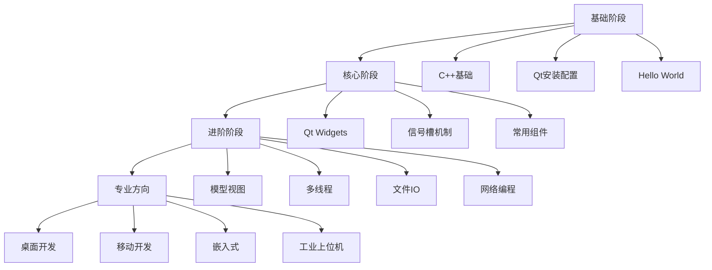
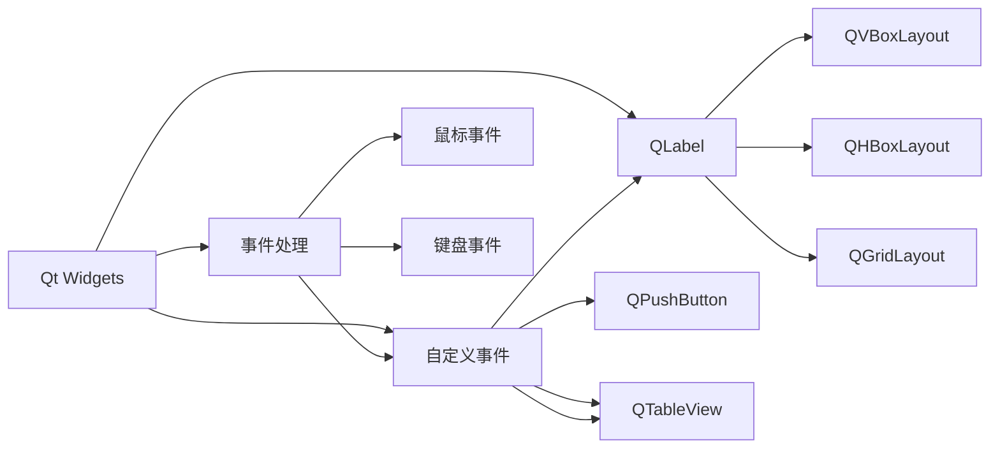
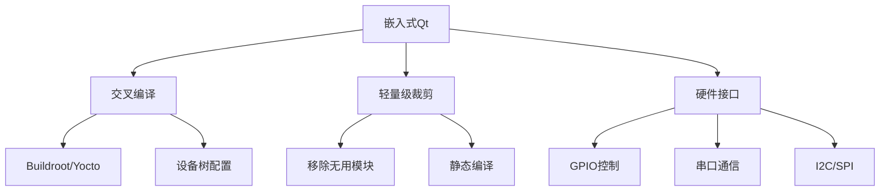

# Qt 上位机开发学习路线（针对有 C/C++/Python/嵌入式基础）

## 一、学习路线全景图



## 二、分阶段学习路径（建议时长：3-6个月）

### 阶段1：基础入门（1-2周）
| 主题           | 学习内容                           | 实践项目       |
| -------------- | ---------------------------------- | -------------- |
| **C++基础**    | 类与对象、继承多态、STL容器        | 学生管理系统   |
| **Qt安装**     | Qt Creator配置、构建套件选择       | 多平台环境搭建 |
| **第一个程序** | QApplication、QWidget、QPushButton | 登录窗口       |
| **信号槽**     | connect()函数、自定义信号槽        | 计算器应用     |

### 阶段2：核心组件（3-4周）


**实践项目**：
1. 文本编辑器（菜单/工具栏/状态栏）
2. 图片浏览器（文件操作/缩放）
3. 数据采集表单（验证/提交）

### 阶段3：关键技术（4-6周）
| 模块          | 核心类                                        | 应用场景     |
| ------------- | --------------------------------------------- | ------------ |
| **模型/视图** | QAbstractItemModel、QTableView                | 数据库展示   |
| **多线程**    | QThread、QtConcurrent、QMutex                 | 实时数据处理 |
| **文件IO**    | QFile、QDir、QFileSystemWatcher               | 日志监控     |
| **网络编程**  | QTcpSocket、QUdpSocket、QNetworkAccessManager | 聊天程序     |
| **数据库**    | QSqlDatabase、QSqlQuery                       | CRM系统      |

### 阶段4：专业方向（持续深化）
#### 1. 桌面应用开发
- **核心技术**：QML、Qt Charts、Qt WebEngine
- **项目实战**：股票分析软件、Markdown编辑器
- **优化重点**：响应式布局、本地存储、自动更新

#### 2. 移动应用开发
- **技术栈**：Qt Quick Controls 2、传感器API、移动支付
- **项目实战**：健康监测APP、AR导航应用
- **平台特性**：Android/iOS适配、触摸手势

#### 3. 嵌入式开发


## 三、学习资源推荐

### 官方资源
1. [Qt官方文档](https://doc.qt.io/) - 最权威的参考
2. Qt Creator内置示例（300+实例）
3. Qt在线课程（Qt Academy）

### 中文资源
1. 书籍：《Qt Creator快速入门》《Qt5编程入门》
2. 视频：B站"Qt开发教程"系列（播放量超百万）
3. 社区：Qt中文网、CSDN Qt专栏

### 开源项目
1. **qBittorrent** - BT下载工具（C++/Qt）
2. **Krita** - 数字绘画软件（复杂UI实现）
3. **深度终端** - 国产Linux终端（嵌入式适配）

## 四、实践项目路线

```mermaid
gantt
    title Qt学习项目路线
    dateFormat  YYYY-MM-DD
    section 基础阶段
    C++基础           ：done,    des1, 2023-07-01, 7d
    HelloQt           ：active,  des2, 2023-07-08, 3d
    计算器            ：          des3, 2023-07-11, 5d
    
    section 核心阶段
    文本编辑器         ：          des4, 2023-07-16, 10d
    图片浏览器         ：          des5, 2023-07-26, 7d
    数据采集系统       ：          des6, 2023-08-02, 14d
    
    section 进阶阶段
    网络聊天室         ：          des7, 2023-08-16, 14d
    工业监控界面       ：          des8, 2023-08-30, 21d
    
    section 专业方向
    跨平台APP         ：          des9, 2023-09-20, 30d
    嵌入式HMI         ：          des10, 2023-10-20, 45d
```

## 五、避坑指南

### 常见问题解决
| 问题           | 解决方案                       |
| -------------- | ------------------------------ |
| 信号槽不生效   | 检查Q_OBJECT宏、函数签名匹配   |
| 界面卡顿       | 使用多线程、QTimer::singleShot |
| 内存泄漏       | 遵循父子对象树、使用QPointer   |
| 跨平台渲染差异 | 使用QStyle、样式表适配         |

### 高效学习法
1. **逆向学习法**：从官方示例反推实现
2. **模块化练习**：每天攻克一个组件（如QTableView）
3. **双屏开发**：左文档右代码的对照学习
4. **社区驱动**：Stack Overflow提问/GitHub提issue

## 六、职业发展路径

### 能力矩阵
| 级别 | 能力要求          | 薪资范围（国内） |
| ---- | ----------------- | ---------------- |
| 初级 | Widgets基础开发   | 8-15K            |
| 中级 | 模块设计/跨平台   | 15-25K           |
| 高级 | 框架定制/性能优化 | 25-50K           |
| 专家 | 架构设计/源码贡献 | 50K+             |

### 行业应用
1. **工业控制**：SCADA系统、HMI界面
2. **汽车电子**：车载信息娱乐系统
3. **医疗设备**：医学影像工作站
4. **金融科技**：交易终端

## 七、学习检查清单

完成以下任务时，您已掌握Qt开发：
- [ ] 能独立开发数据可视化应用
- [ ] 实现网络通信模块（TCP/UDP）
- [ ] 完成多线程数据采集程序
- [ ] 打包发布到3种平台（Win/macOS/Linux）
- [ ] 为开源Qt项目贡献PR
- [ ] 掌握一种QML高级特效（粒子/着色器）

> 坚持每日编码：80%的时间写代码，20%的时间阅读文档  
> 加入Qt社区：参加线下Meetup，关注Qt年度峰会  
> 构建作品集：GitHub是程序员最好的简历

按照此路线系统学习，6个月内可达到企业级开发要求，1年可成为资深Qt开发者。关键在于坚持实践和项目驱动学习！


#### **阶段 1：Qt 基础与核心概念（1-2 周）**
1. **Qt 框架入门**
   - 学习目标：理解 Qt 核心机制和基础组件。
   - 学习内容：
     - Qt 信号与槽（Signal & Slot）：掌握跨对象通信方式。
     - 元对象系统（Meta-Object System）：理解 `moc` 原理。
     - 内存管理：`QObject` 父子对象树机制。
     - 常用核心类：`QString`、`QList`、`QVariant`、`QFile`。
   - 实践：编写简单程序（如点击按钮改变文本）。

2. **Qt Widgets 基础**
   - 学习内容：
     - 常用控件：`QLabel`、`QPushButton`、`QLineEdit`、`QComboBox`。
     - 布局管理器：`QHBoxLayout`、`QVBoxLayout`、`QGridLayout`。
     - 主窗口框架：`QMainWindow`（菜单栏、工具栏、状态栏）。
   - 工具：熟练使用 **Qt Designer** 拖拽设计 UI，生成 `.ui` 文件。
   - 实践：实现一个简单的计算器界面。

---

#### **阶段 2：关键技术深入（2-3 周）**
1. **多线程与异步处理**
   - 学习内容：
     - `QThread` 的两种用法（子类化 vs `moveToThread`）。
     - 线程安全：`QMutex`、`QSemaphore`。
     - 异步通信：`QTimer`、`QEventLoop`。
   - 实践：在 GUI 中实时显示后台数据处理进度。

2. **串口通信（嵌入式关键）**
   - 模块：`QtSerialPort`
   - 学习内容：
     - 串口配置：波特率、数据位、停止位。
     - 数据读写：`QSerialPort::read()`/`write()`。
     - 信号：`readyRead()` 处理接收数据。
   - 实践：实现一个串口调试助手（收发 HEX/ASCII 数据）。

3. **网络通信**
   - 学习内容：
     - TCP：`QTcpSocket`/`QTcpServer`。
     - UDP：`QUdpSocket`。
     - HTTP：`QNetworkAccessManager`。
   - 实践：开发一个 TCP 客户端/服务器聊天工具。

---

#### **阶段 3：数据与图形化（1-2 周）**
1. **数据处理与存储**
   - 学习内容：
     - JSON：`QJsonDocument`、`QJsonObject`。
     - XML：`QXmlStreamReader`/`QXmlStreamWriter`。
     - 文件操作：`QFile`、`QDataStream`。
     - 数据库：`QSqlDatabase`（SQLite 集成）。
   - 实践：将传感器数据保存为 JSON/SQLite 文件。

2. **数据可视化**
   - 模块：`QtCharts`
   - 学习内容：
     - 创建折线图、柱状图。
     - 实时动态更新图表。
   - 实践：绘制串口接收的传感器数据波形图。

---

#### **阶段 4：项目实战（2-4 周）**
**项目：嵌入式上位机监控系统**  
- **核心功能**：
  - 通过串口/网络与下位机（单片机）通信。
  - 实时显示传感器数据（温度、电压等波形图）。
  - 控制指令下发（如继电器开关）。
  - 数据存储与回放（数据库 + 图表）。
  - 日志记录与报警功能。
- **技术栈**：
  ```cpp
  // 示例代码：串口数据读取
  QSerialPort serial;
  serial.setPortName("COM3");
  serial.setBaudRate(QSerialPort::Baud115200);
  if (serial.open(QIODevice::ReadWrite)) {
      connect(&serial, &QSerialPort::readyRead, [&]() {
          QByteArray data = serial.readAll();
          emit newData(data); // 触发数据处理信号
      });
  }
  ```

---

#### **阶段 5：进阶优化（可选）**
1. **QML 与现代化 UI**
   - 学习 `Qt Quick` 开发炫酷界面（适合嵌入式 HMI）。
2. **跨平台与部署**
   - 学习多平台编译（Windows/Linux/嵌入式 Linux）。
   - 掌握 `windeployqt` 打包 Windows 应用。
3. **性能优化**
   - 减少 UI 卡顿（多线程 + 事件驱动）。
   - 资源管理（QPixmap 缓存、内存泄漏检测）。

---

#### **学习资源推荐**
- **官方文档**：[doc.qt.io](https://doc.qt.io/)（必看！）
- **书籍**：
  - 《C++ GUI Qt 4 编程》
  - 《Qt 5 编程入门》
- **视频教程**：
  - 哔哩哔哩：Qt 官方教程、季峰老师课程。
- **开源项目参考**：
  - [QSerialPort](https://github.com/qt/qtserialport)
  - [Serial Studio](https://github.com/Serial-Studio/Serial-Studio)（优秀串口工具）

---

#### **关键建议**
1. **从 Qt Widgets 开始**：先掌握传统桌面开发，再学 QML。
2. **边学边做**：每个知识点配套小项目（如串口助手→数据监控系统）。
3. **善用调试工具**：Qt Creator 的调试器、`qDebug()` 输出。
4. **参与社区**：[Qt 论坛](https://forum.qt.io/)、Stack Overflow。

> 学习周期：约 2-3 个月可达到开发中等复杂度上位机水平。嵌入式背景是你的优势，理解硬件通信协议（如 Modbus）会让开发更高效！