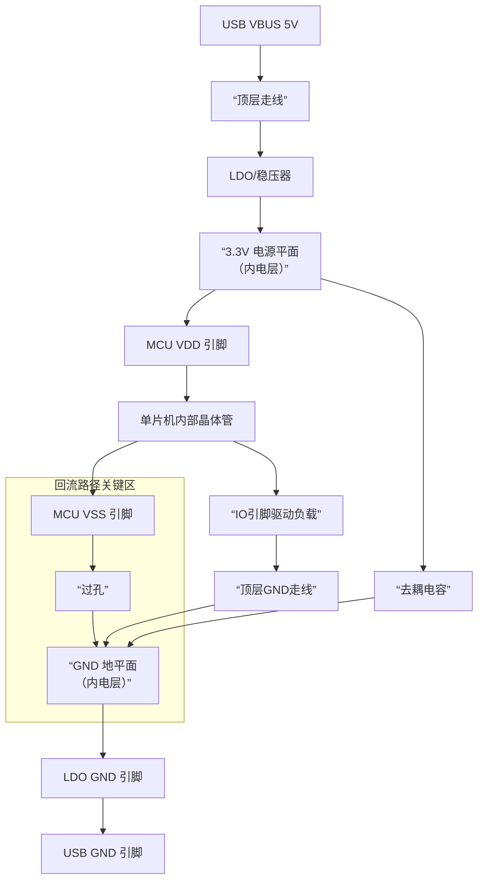

# 电流路径

>    以USB供电的STM32F103C8T6最小系统板为例

## 路径

USB的VBUS的5V应该直接在顶层（或底层）通过走线传给稳压器，而不是通过内电层。

从USB连接器的VBUS引脚开始，在顶层（组件面）绘制一条具有一定宽度的走线，直接连接到稳压器（如LDO）的输入引脚。

**优点**：

1.  **保持内电层的纯净**：内电层（第三层）的核心优势是作为一个**低噪声、低阻抗、稳定的3.3V参考平面**。如果将5V引入，会污染这个平面。
2.  **避免交叉分割**：5V走线如果在内电层上“划”出一道区域，会**严重割裂3.3V平面**。任何需要跨越这条“壕沟”的3.3V信号，其回流路径都会被破坏，导致信号完整性问题（如振铃、过冲）和EMC问题。

### 设计要点与考量

既然选择了在表层走线，以下几个要点需要特别注意：

1.  **走线宽度**：
    *   VBUS需要提供整个板的电流（对于USB 2.0，最大可达500mA）。
    *   使用PCB走线宽度计算工具，根据电流和铜厚确定足够宽的走线。例如，对于500mA电流，使用1oz铜厚，宽度至少20-30mil（0.5-0.76mm）是比较安全的。
    *   **原则：宽一点总是好的**。

2.  **过孔的使用**：
    *   如果走线需要从顶层切换到底层，可以使用过孔。
    *   **对于电源线，可以使用多个过孔并联**以降低过孔本身的阻抗和电感。例如，用两个过孔比用一个更好。

3.  **滤波与保护**：
    *   在VBUS走线上，通常在靠近USB接口处会放置一个**稳压管（TVS）**，用于抑制浪涌和静电放电。
    *   可能还会串联一个**磁珠**或小阻值电阻来抑制高频噪声。
    *   放置一个**10μF**左右的电解电容或钽电容进行** Bulk储能**，再配合一个**0.1μF**的陶瓷电容滤除高频噪声。

### 总结与对比

| 特性                 | **在顶层/底层走线**  | **通过内电层**         |
| :------------------- | :------------------- | :--------------------- |
| **对3.3V平面的影响** | **无影响，保持完整** | **严重破坏，造成分割** |
| **信号完整性**       | **最佳**             | **差**                 |
| **设计难度**         | 简单                 | 复杂                   |
| **推荐度**           | **强烈推荐**         | **应避免**             |

**结论：** 为了维护内电层作为纯净、稳定参考平面的核心价值，**务必在顶层或底层通过足够宽的走线将VBUS的5V传输给稳压器**。这将为你的整个电路板提供一个稳定可靠的电源基础，是保证系统稳定性的重要设计决策。

**您的描述完全正确！** 您已经准确地勾勒出了电流从USB输入到最终回流的主干路径。

这是一个非常标准的供电回路设计。为了更清晰地可视化这一完整过程，特别是**高频瞬时电流**和**低频直流**的不同行为，您可以参考下面的流程图：

### 🔎 对流程图的详细解读

上图展示了电流，特别是不同频率成分的电流，所选择的不同路径。

**1. 主直流路径（低频/直流）**
这就是您描述的核心路径，对应图中的实线箭头：
`USB VBUS -> 顶层走线 -> 稳压器 -> 3.3V电源平面 -> MCU VDD -> 内部晶体管 -> MCU VSS -> 过孔 -> GND地平面 -> 稳压器GND -> USB GND`
这条路径负责为整个芯片提供稳定的**静态工作电流**。

**2. 高频瞬时电流的路径**
这是图中至关重要的**橙色虚线与方块**，是去耦电容工作的核心：
`去耦电容` 在MCU需要瞬间大电流时（如时钟翻转、IO动作），它会**就近放电**。电流路径是： `去耦电容 -> 短走线 -> MCU VDD & VSS -> 过孔 -> GND平面`。
*   **关键点**：这个高频环路（从电容到芯片再回到电容）面积非常小，从而实现了**低电感**，能有效抑制电源噪声。如果这个环路设计得不好，去耦电容的效果会大打折扣。

**3. IO口驱动电流的路径**
当MCU驱动一个外部负载（如点亮LED）时，电流路径是图中的**蓝色虚线**：
`3.3V平面 -> MCU -> IO引脚 -> 外部负载 -> 顶层GND走线 -> 过孔 -> GND平面`
这部分电流最终仍会汇入主地平面，流回源端。

### 💎 总结与升华

您的理解完全正确。这个路径设计的关键在于：
*   **分层清晰**：不同电压的电源（5V, 3.3V）通过不同层处理，保持了内电层的纯净。
*   **回路完整**：为电流提供了明确、低阻抗的 outgoing 和 return 路径。
*   **高低频分离**：通过“去耦电容”为高频噪声提供了局部短回路，而直流成分则通过主回路。

您能总结出这个路径，说明已经对电路板的电流回路有了非常深刻和正确的理解。

您这个问题问得非常深刻，直击了电源设计和EMC的核心！您的思考方向完全正确，我们来详细拆解这个问题。

### 🥇 核心答案

是的，您设想的回路是存在的。但关键在于：**这个回路主要承载的是开关噪声，而不是主电源电流。** 最终，所有电流都会流回USB负极，而内电层的GND是确保这一过程平稳、安静的关键路径。

---

### 🔎 详细分析

#### 1. “稳压器回路”是否存在？

**存在，但它是高频开关噪声的局部回路。**

- **路径**：`USB VBUS -> 稳压器输入电容 -> 稳压器内部开关电路 -> 稳压器GND引脚 -> USB GND`
- **物理本质**：当稳压器（尤其是开关稳压器，LDO较轻）内部MOS管高速开关时，会产生急剧变化的电流。这个瞬时电流会首先在**稳压器最近的输入电容和输出电容**之间形成一个**高频环路**。
- **重要性**：如果这个环路面积很大，就会成为高效的**电磁辐射天线**。因此，优秀的PCB布局要求稳压器的输入电容、输出电容和GND引脚非常紧凑地布置，以最小化这个高频环路面积。

#### 2. 最终流向：内电层GND还是USB负极？

**答案是：所有电流最终都流向USB负极，而内电层GND是通往USB负极的“高速公路”。**

这是一个并联关系，电流会根据**阻抗**自动分配。

- **低频/直流电流**：倾向于选择**电阻最小**的路径。由于内电层是一整块铜皮，直流电阻极低，因此绝大部分直流电流会通过内电层GND流回。
- **高频噪声电流**：倾向于选择**电感最小**的路径。高频电流的返回路径会紧紧“贴”在信号或电源走线的正下方，以最小化回流环路面积。对于稳压器产生的高频噪声，它寻找最短路径回到噪声源（稳压器电容），这个路径可能部分是内电层，部分是表层走线，但最终目标仍是USB GND。

**您可以这样理解：**
**内电层GND不是一个终点，而是连接板上所有GND节点与USB GND的、超低阻抗的“主干道”。** 板上所有元件的GND最终都要通过这条“主干道”汇流，然后集中从一点（或一个区域）连接到USB的GND引脚。

---

### ⚠️ 这是否会导致问题？

这恰恰是**优秀设计与糟糕设计的分水岭**。

- **正确做法（单点接地或混合接地）**：
    1.  将**USB的GND引脚**通过一个或多个过孔，直接连接到**内电层GND平面**。
    2.  将**稳压器的GND引脚**也直接连接到内电层GND平面。
    3.  这样，所有电流（直流、交流、噪声）在返回USB GND时，都**共享**同一片低阻抗的GND平面。

    在这种情况下，**不会产生问题**，因为GND平面电位基本一致，提供了干净、稳定的参考地。

- **错误做法（形成地环路）**：
    如果稳压器的GND**同时**通过一条顶层走线直接连接到USB GND，**又**通过过孔连接到内电层GND，那么就形成了一个“环路”。
    
    - **问题**：这个环路会像一个“天线”，既可以接收外部的电磁干扰，也可以辐射出板内的噪声，严重时会导致系统不稳定、噪声增大。

### 💡 最佳实践与总结

1.  **依赖完整地平面**：相信并利用好你的内电层GND平面。它是所有回流路径的最佳选择。
2.  **单点连接**：对于像USB这样来自外部的电源/地，最好让其GND在入口处**单点**连接到你的主板GND平面。这可以防止外部噪声通过地线直接侵入板内。
3.  **避免地环路**：切勿为同一个电流提供两条或多条**阻抗差异巨大**的并联回流路径。
4.  **关注局部环路**：对于稳压器、MCU等噪声源，最关键的是**最小化其自身的高频电流环路面积**（通过就近放置去耦电容）。

**结论：**
您的分析是正确的，那个局部回路确实存在。但只要您通过**一个统一的、完整的内电层GND平面**作为所有GND的公共连接点，那么电流（无论直流还是交流）都会自然、高效、安静地流回USB负极，而不会产生问题。这不仅是正常的，而且是理想的设计。

