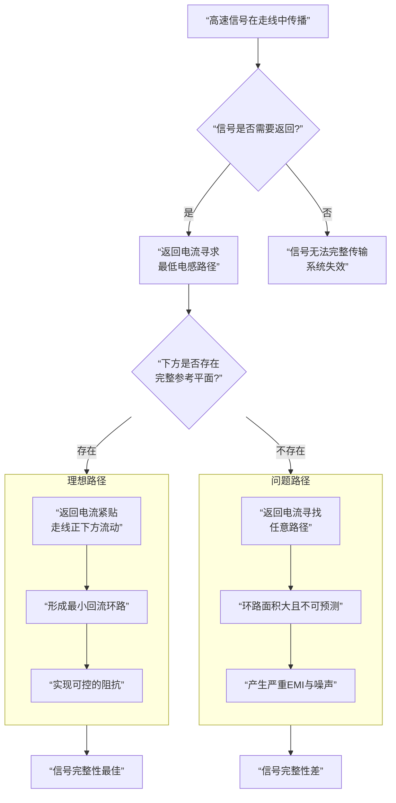

# 内电层

## 内电层结构

内电层是作为一个完整的、大面积的电源（VCC）和地（GND）平面，而不是仅仅在上面走线。

在专业的四层板设计中，内电层（第二层和第三层）的初衷就是作为**完整的电源平面和地平面**。

**第二层**：通常设置为**完整的地平面**。

**第三层**：通常设置为**完整的电源平面**（或者被分割成几个不同电压的区域）。

这种“一整块铜皮”的做法，我们称之为**负片工艺**。

### 在内电层走线（不推荐）

“只是VCC和GND在这一层走线” 这种方式被称为**正片工艺**。

这相当于把内层当作顶层和底层一样的信号层来使用，只是这些走线网络是电源和地。

但是在四层板中不推荐这样做。

因为这样做就**完全失去了使用四层板的巨大优势**。如果在内电层进行复杂的电源走线，它会带来以下问题：

1.  **破坏完整的参考平面**：高频信号的返回电流需要在其下方一个完整的参考平面上流动。如果内层被走线割裂，返回路径会变得曲折，环路面积增大，导致**电磁辐射加剧和抗干扰能力下降**。
2.  **增加电源阻抗**：细长的走线相比大面积的铜皮，直流电阻和交流电感都大得多，无法提供稳定、低阻抗的电源。
3.  **去耦效果变差**：去耦电容需要通过短而粗的路径连接到完整的平面上才能发挥最佳效果。

## 内电层分割

虽然内电层是完整的平面，但一个系统通常有多种电源（如3.3V， 5V， 1.2V等）。这时就需要用到**内电层分割**。

**概念**：在完整的电源层上，通过绘制隔离带，将其划分成几个互不连接的孤岛，每个孤岛分配一个不同的电源网络。

**原则**：

- **优先保证地平面的完整性**，**绝对不要**在地平面上进行分割。
- 预先规划，分割区域要尽量规整，避免出现细长的“半岛”。
- 为主要的、电流大的电源（如核心电压）分配面积足够大的区域。

**将内电层作为整体平面**，是获得稳定、可靠、低噪声电路性能的**最关键设计决策之一**。除非你的电路非常简单且对性能毫无要求，否则不应将其用作普通的走线层。

## 过孔连接

顶层MCU的VCC和GND引脚是通过**过孔** 连接到内电层的。

- **GND连接**：在MCU的GND引脚旁边放置一个**过孔**，将这个引脚与**第二层（完整地平面）** 直接连接起来。
- **VCC连接**：在MCU的VCC引脚和去耦电容旁边放置一个**过孔**，将这个引脚与**第三层（电源平面）** 直接连接起来。

过孔就像一个“垂直的隧道”，将不同层级的铜箔电气连接在一起。

### 具体操作与最佳实践

仅仅打通过孔还不够，正确的做法决定了电源完整性和信号完整性。

#### 对于GND引脚

**目标：提供最短、最低阻抗的返回路径。**

- **就近打孔**：在MCU的每个GND引脚旁边，尽可能近地放置一个到地平面的过孔。如果空间有限，可以共享过孔，但优先保证每个引脚都有独立的低阻抗路径。
- **直接连接**：在EDA软件中，当GND引脚通过走线连接到GND过孔时，这个连接在内电层上会通过一个**热焊盘** 与整个地平面相连。

**什么是热焊盘？**
它是过孔与内电层大面积铜皮连接时，一个带有“隔热连接”的特殊焊盘。它既保证了电气连接，又防止了大面积铜皮在焊接时散热过快导致焊接不良。

#### 对于VCC引脚

**目标：提供稳定、干净的电源，并确保去耦电容高效工作。**

- **“先电容，后过孔”原则**：这是**至关重要**的一步。电流的路径应该是：
  **电源平面 -> 过孔 -> 去耦电容 -> MCU的VCC引脚。**
- **具体布局**：
  1.  MCU的VCC引脚先通过一根短而粗的走线连接到旁边的**去耦电容**的一端。
  2.  该去耦电容的另一端通过过孔连接到GND平面。
  3.  在**去耦电容的VCC端旁边**，再放置一个过孔，向下连接到电源平面。

这样，从电源平面来的电流首先到达去耦电容，再供给MCU引脚。当MCU需要瞬时大电流时，去耦电容可以以最短的路径迅速放电，发挥最佳效果。

*△ 一个理想化的去耦电路布局示意图，注意VCC过孔靠近电容放置*

---

### 📝 设计检查清单

在进行PCB布局时，请遵循以下要点：

- **过孔数量**：不要吝啬使用过孔。对于电流较大的电源网络（如主VCC），可以使用多个过孔并联以降低阻抗。
- **过孔尺寸**：使用合适的过孔尺寸。通常，信号过孔可以小一些（如0.3mm孔/0.6mm盘），电源过孔可以稍大一些（如0.4mm孔/0.8mm盘），以承载更大电流。
- **最短路径**：确保每一个VCC引脚和GND引脚到其相应平面的路径**尽可能短**。这意味走过孔要尽量靠近引脚。
- **检查连接**：在EDA软件中使用高亮或DRC功能，检查是否所有电源和地网络都正确连接到了内电层，没有悬空。

### 💎 总结

总结一下，顶层MCU的VCC和GND是通过**过孔**垂直连接到内电层的。

- **GND引脚** → **就近打过孔** → **连接到完整的地平面**。
- **VCC引脚** → **先连接去耦电容** → **在电容旁打过孔** → **连接到电源平面**。

严格遵守“**先电容，后过孔**”和“**就近接地**”的原则，是确保你的STM32最小系统板稳定可靠工作的基石。希望这些具体的解释能帮助你顺利完成设计！

非常好的问题！这直接关系到高速PCB设计的本质。内电层能作为参考平面，核心原因在于它为解决高速电路的两个根本问题提供了完美答案：**提供清晰、稳定的信号返回路径**和**形成可控的传输线结构**。

为了让这个抽象的概念更直观，你可以将信号传输想象成一场在精密管道系统中的流动。下面的流程图揭示了参考平面在其中扮演的关键角色：

### 🔎 从电流回流的视角看

上图清晰地展示了，没有参考平面，返回电流将无处安放，导致系统性能恶化。而一个完整的参考平面（通常是地平面）为返回电流提供了唯一明确、低阻抗的路径。

**为什么这如此重要？**
1.  **最小化环路面积**：根据电磁学理论，环路面积越大，天线效应越强，电磁辐射和接收干扰的能力也越强。参考平面将环路面积缩至最小，从根本上提升了电磁兼容性。
2.  **提供稳定参考电位**：所有信号电压都是相对于某个参考点（通常是地）定义的。一个完整、纯净的地平面为所有信号提供了一个稳定、一致的“电压基准”，确保信号幅度的准确识别。

---

### 📏 从传输线理论的视角看

当信号边沿足够陡峭（高频成分丰富）时，PCB走线不再是普通导线，而是成为**传输线**。传输线的核心特征是**特性阻抗**。

*   **特性阻抗的形成**：它由单位长度的分布电感和分布电容决定（Z₀ = √(L/C)）。
*   **参考平面的作用**：内电层与信号层紧密相邻，构成了一个**均匀、可预测的电容和电感耦合系统**。这种稳定的物理结构使得我们能够通过精确控制**线宽、介质厚度和介电常数**，来计算出并控制特性阻抗。

**如果没有一个完整的参考平面**：
*   返回路径不确定，分布电感和电容会变得不可预测。
*   **特性阻抗将无法控制**，导致信号在阻抗突变点发生反射，引起振铃、过冲等信号完整性问题。

---

### 🛡️ 额外的强大优势

除了上述两个核心原因，内电层作为参考平面还带来以下好处：

1.  **优异的去耦和旁路**：
    *   信号线与地平面之间自然形成的电容，以及芯片电源引脚与地平面之间形成的电容，为高频噪声提供了一个极其便捷的“短路到地”的路径。
    *   这极大地增强了常规去耦电容的效果，能有效滤除电源噪声。

2.  **天然的屏蔽层**：
    *   一个完整的地平面可以隔离它两侧的信号层，防止它们相互串扰。
    *   它也能屏蔽外部干扰，使板卡更稳健。

### 💎 总结

所以，内电层（尤其是地平面）能作为参考平面，不是因为它是一块铜皮，而是因为它：

*   **为高频返回电流提供了唯一、明确、最低阻抗的路径**，最小化环路面积，改善EMC。
*   **与信号线构成可控、均匀的传输线结构**，使得精确的阻抗控制成为可能，保障信号完整性。
*   **同时提供了分布式电容**，用于高频去耦和屏蔽。

这就是为什么在高速PCB设计中，我们如此强调“保持参考平面的完整性”——任何切割或缝隙都会破坏上述优势，带来一系列难以调试的问题。