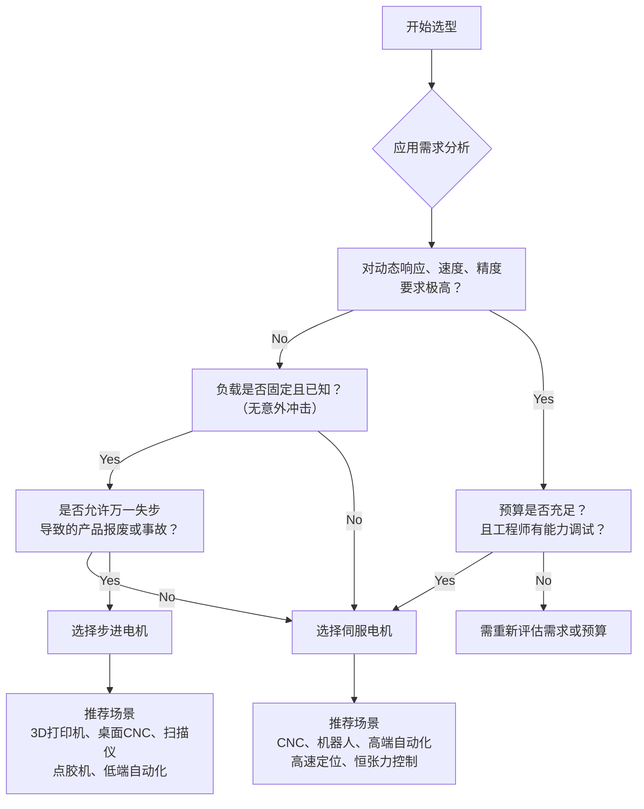

# 步进电机与伺服电机

## 步进电机

## 伺服电机

### 什么是伺服电机？

**伺服电机（Servo Motor）** 是一个**系统**的概念，它指的并不是一个单独的电机，而是一个**完整的闭环控制系统**。这个系统的任务是使**输出的机械位移（位置、速度、转矩）** 能**准确、快速**地**跟随**输入的控制指令。

### 伺服系统包括什么？

一套典型的伺服系统由以下四个关键部分组成：

1.  **伺服电机（本体）**
    *   **作用**： 系统的执行器，负责将电能转化为机械能。
    *   **类型**：
        *   **交流永磁同步伺服电机 (PMSM)**： 这是当前**绝对的主流**。其转子是永磁体，具有高功率密度、高响应速度、高精度的特点。通常采用我们之前讨论的**FOC算法**进行控制。
        *   **直流伺服电机**： 较早的技术，通过电刷和换向器工作，存在维护问题，现已逐渐被交流伺服取代。
    *   特点是转子惯性小，启动停止迅速。

2.  **伺服驱动器 (Servo Drive / Amplifier)**
    *   **作用**： 系统的“大脑”和“心脏”。它接收来自控制器的指令，并驱动电机按指令要求运动。
    *   **功能**：
        *   接收**位置、速度或转矩指令**（通常是脉冲或模拟量）。
        *   接收来自**编码器**的反馈信号。
        *   进行复杂的**闭环控制运算**（通常是三环控制）。
        *   输出强大的**电流/电压**驱动电机。
        *   提供各种保护功能（如过流、过压、过热保护）。

3.  **编码器 (Encoder)**
    *   **作用**： 系统的“眼睛”。它是安装在电机轴上的传感器，用于**实时检测**电机的**转子位置、速度和转动圈数**。
    *   **重要性**： 这是实现**闭环控制**的基石。没有它，驱动器就不知道电机实际转得怎么样，也就无法进行精确校正。
    *   **类型**： 主要有**增量式编码器**和**绝对式编码器**。后者在断电后也能记住绝对位置，无需寻零操作，更为先进。

4.  **控制器 (Controller)**
    *   **作用**： 系统的“指挥官”。它根据预设的程序或逻辑，生成运动轨迹指令（如：以1000 RPM的速度转到180°的位置），并发送给伺服驱动器。
    *   **形式**： 可以是PLC（可编程逻辑控制器）、专用的运动控制卡、工控机，甚至是单片机。

### 闭环控制（三环控制）

这是伺服电机实现高精度的核心技术。控制系统内部存在三个嵌套的闭环：

1.  **位置环（最外环）**
    *   **输入**： 控制器发出的**目标位置**指令。
    *   **反馈**： 编码器测得的**实际位置**。
    *   **作用**： 计算位置误差，并输出一个**目标速度**指令给速度环，确保最终能停在精确的位置上。

2.  **速度环（中间环）**
    *   **输入**： 位置环给出的**目标速度**。
    *   **反馈**： 编码器测得的**实际速度**（通常由位置微分计算得到）。
    *   **作用**： 计算速度误差，并输出一个**目标转矩**指令给电流环，确保速度平稳、响应快速。

3.  **电流环/转矩环（最内环）**
    *   **输入**： 速度环给出的**目标转矩**（对应目标电流）。
    *   **反馈**： 驱动器检测到的电机**实际相电流**。
    *   **作用**： 计算电流误差，并快速调整输出给电机的电压/电流，以精确控制**输出转矩**。这是响应最快的环路。

**这个过程是瞬间、连续不断进行的**，从而保证了系统能够快速抑制外部干扰（如负载突然变化），始终精准跟随指令。

### 核心特点

与步进电机等开环控制电机相比，伺服电机的优势非常明显：

*   **精度高**： 闭环控制可以消除误差（如失步、丢步），定位精度可达±1个脉冲以内。
*   **响应快**： 转子惯量小，转矩大，加速性能优异，从静止到额定转速仅需几毫秒。
*   **速度范围宽**： 低速平稳无抖动，高速性能好。
*   **过载能力强**： 能提供数倍于额定转矩的瞬间峰值转矩，以应对紧急加速或克服巨大阻力。
*   **控制灵活**： 支持**转矩控制**、**速度控制**、**位置控制**三种基本模式，并可平滑切换。

### 主要应用领域

伺服电机广泛应用于需要**精密控制**的任何场合：

*   **工业机器人**： 关节驱动，实现精准运动。
*   **数控机床 (CNC)**： 控制刀架、主轴的移动和转速。
*   **自动化生产线**： 物料搬运、精准定位、装配、包装。
*   **半导体设备**： 晶圆搬运、光刻机、焊线机。
*   **航空航天**： 舵机控制、模拟平台。

### 关键参数

*   **额定转速**： 电机长期正常工作的速度。
*   **额定转矩**： 电机长期正常工作的输出转矩。
*   **瞬间最大转矩**： 电机在短时间内能提供的最大力量。
*   **惯量**： 转子惯量需要与负载惯量匹配（有惯量匹配原则）。
*   **编码器分辨率**： 分辨率越高，控制精度潜力越大。
*   **安装尺寸和轴径**： 机械安装接口。

### 关键性能指标判断

1.  **额定值与峰值值 (Rated vs. Peak)**
    *   **额定转矩/电流/速度**： 电机可**连续运行**而不至于过热的输出能力。是长期工作的依据。
    *   **峰值转矩/电流**： 电机在**短时间（通常几秒）** 内能提供的最大输出能力。用于克服惯性加速或瞬间重载。**伺服电机的过载能力是其强大性能的关键**（通常可达额定值的2-3倍）。

2.  **分辨率与精度 (Resolution vs. Accuracy)**
    *   **分辨率**： 编码器能检测到的最小位置变化量。例如，一个23位分辨率的编码器，一转有 `2^23 = 8,388,608` 个脉冲。分辨率越高，控制潜在的**平滑度**和**精度**就越高。
    *   **精度**： 实际位置与指令位置之间的**最大偏差**。高分辨率是 high 精度的必要条件，但不是充分条件。精度还受机械加工、轴承游隙、温度漂移等因素影响。

3.  **刚性 (Stiffness)**
    *   在位置模式下，指系统抵抗外力试图改变其位置的能力。可以理解为位置环的**P增益（比例增益）**。
    *   **高刚性**： 响应快，定位准，但过高的刚性容易引发振荡（电机发出嗡嗡声）。
    *   **低刚性**： 响应慢，到达目标位置时有缓冲效应，但运动更平滑。**伺服调试的一个重要环节就是“刚性调整”**，在响应性和稳定性之间取得最佳平衡。

4.  **响应带宽 (Bandwidth)**
    *   系统能够有效跟随指令变化的最高频率。带宽越高，伺服系统就能越快地对指令做出反应，**滞后越小**，抗扰动能力越强。它反映了系统的**快速性**。

5.  **惯量匹配 (Inertia Match)**
    *   这是选型中**至关重要**的概念。指**负载惯量 `J_load`** 与**电机转子惯量 `J_motor`** 的比值。
    *   **经验法则**： 对于高动态响应应用（如机器人），推荐 `J_load / J_motor < 10`。对于普通应用，可放宽到 ` < 30`。
    *   **不匹配的后果**：
        *   **负载惯量过大**： 系统响应迟钝，加速慢，需要更大扭矩的电机，稳定性变差。
        *   **负载惯量过小**： 可能导致控制超调、振荡，难以稳定。有时需要增加减速机或刹车盘来增加负载惯量。

### 总结：伺服系统的精髓

伺服电机不仅仅是一个“更精确的电机”，它是一个**完整的、高度可配置的动态系统**。其精髓在于：

*   **反馈闭环**： 通过实时反馈进行精确校正，这是一切的基础。
*   **三环结构**： 电流、速度、位置三环嵌套，实现了对力矩、转速和位置的逐级精确控制。
*   **动态性能**： 关注峰值能力、响应带宽和惯量匹配，以满足高速高精的应用需求。
*   **系统集成**： 与上位控制器通过高级总线连接，成为智能制造和数字化工厂中一个智能的执行节点。

理解并掌握这些深入的概念，才能真正地“驾驭”伺服电机，而不仅仅是“使用”它。

## 对比总结

### 表格

| 特性维度         | 步进电机 (Stepper Motor)                         | 伺服电机 (Servo Motor)                                   |
| :--------------- | :----------------------------------------------- | :------------------------------------------------------- |
| **控制原理**     | **开环控制**（无反馈）                           | **闭环控制**（有反馈）                                   |
| **控制方式**     | 通过脉冲数控制角度，无反馈                       | 实时检测位置/速度反馈，动态调整                          |
| **精度**         | **中等**（理论值高，但可能失步）                 | **极高**（由编码器保证，无累积误差）                     |
| **扭矩特性**     | **低速扭矩大**，高速时扭矩急剧下降               | **全速度区间扭矩稳定**，过载能力强（2-3倍额定扭矩）      |
| **响应与速度**   | 启动速度慢，高速性能差，易振动                   | 响应极快，加速性能好，高速性能优异，运行平稳             |
| **振动与噪音**   | 低速时可能振动，噪音较大（尤其低频）             | 运行平滑，噪音小（高频啸叫可能）                         |
| **成本**         | **低**（电机、驱动器、系统总成本低）             | **高**（电机、驱动器、编码器导致成本高）                 |
| **复杂性**       | 系统简单，易于安装和调试                         | 系统复杂，需要参数整定和调试                             |
| **过载影响**     | 过载会导致**失步**，且系统无法感知               | 过载会触发驱动器报警停机，保护系统                       |
| **最佳应用场景** | 低成本、低速、中低精度、负载稳定、开环可行的场合 | 高速度、高精度、高动态响应、负载变化大、要求可靠性的场合 |

### 深入对比分析

#### 控制原理：开环 vs. 闭环

这是最根本的区别，决定了它们的所有特性。

*   **步进电机（开环）**：
    *   驱动器接收到一个脉冲，电机就转动一个固定的角度（如1.8°或0.9°）。**系统假设电机始终严格按脉冲指令运动**。
    *   **致命缺点**： 如果由于负载过大、速度过高或加速度太快导致电机扭矩不足，转子无法到达指令位置，就会出现“**失步（Lost Steps）**”。而**控制系统无法得知这一错误**，从而造成永久性的位置误差。

*   **伺服电机（闭环）**：
    *   驱动器不仅接收运动指令，还**实时接收编码器反馈的实际位置和速度**。
    *   控制器比较指令位置和实际位置，如果存在误差（如因负载冲击导致位置滞后），它会**自动增大电流输出**来纠正这个误差，确保电机始终紧跟指令。
    *   **核心优势**： **永不失步**，可靠性极高。

#### 性能特性对比

*   **精度**：
    *   **步进电机**： 精度取决于步距角。例如，1.8°的电机每转200步。通过驱动器细分，可以获得更高的“理论精度”，但无法提高实际机械精度，甚至可能引入振动。
    *   **伺服电机**： 精度由编码器分辨率决定。常见编码器每转可达10000线以上，通过倍频后分辨率远超步进电机。且是真实的位置反馈，精度有保证。

*   **扭矩与速度关系**：
    *   **步进电机**： 扭矩随转速升高而**急剧下降**。这是因为电机绕组的电感效应导致电流跟不上脉冲频率的变化。这使得它非常不适合高速应用。
    *   **伺服电机**： 在额定转速内，可以输出**恒定的额定扭矩**（额定功率）。并且有巨大的瞬时过载能力（2-3倍额定扭矩）来应对加速和冲击负载。

*   **运行平稳性**：
    *   **步进电机**： 本质上是逐步运动的，即使在低速时也可能产生振动和噪音。细分驱动可以缓解但无法根除。
    *   **伺服电机**： 采用正弦波驱动（FOC），运动极其平滑安静，尤其是在低速时。

#### 成本与复杂性

*   **步进电机**： 系统构成简单（驱动器 + 电机），**成本低廉**，接线和设置简单，对工程师要求低。
*   **伺服电机**： 系统构成复杂（驱动器 + 电机 + 编码器），**成本高昂**，需要复杂的调试（如PID参数整定）才能发挥最佳性能，对工程师要求高。

### 如何选择？

