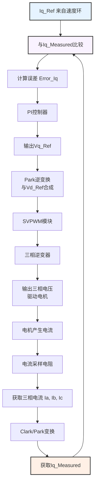

# FOC电流闭环

好的，我们接着来深入探讨FOC（磁场定向控制）中的**电流闭环**理论。它是整个FOC系统的基石和内环核心，其性能直接决定了整个系统的动态响应和控制精度。

---

### 1. 电流环的核心地位与目标

在FOC的级联控制结构中，电流环是**最内层、最快速**的闭环。

*   **核心地位**：它是连接控制算法（软件）和物理电机（硬件）的桥梁。所有外环（速度环、位置环）的指令，最终都必须通过电流环来具体执行。
*   **核心目标**：快速、精确地控制电机定子绕组的电流，使其能够**无静差地跟踪**由外环计算出的电流指令值（`Id_Ref` 和 `Iq_Ref`）。

---

### 2. 为什么需要电流环？

没有电流环的FOC是不可想象的，原因如下：

1.  **实现解耦控制**：FOC的理论基础是通过Park变换将交流量变为直流量（Id, Iq）进行控制。电流环的任务就是在旋转坐标系（d-q轴）下，对这两个直流量进行独立的**PI控制**，从而真正实现转矩（Iq）和励磁（Id）的**解耦控制**。没有电流环，解耦就无法在实际中实现。
2.  **对抗反电动势和扰动**：电机旋转时会产生反电动势（Back-EMF），负载变化也会引起扰动。这些都会阻碍电流按照预期变化。电流环作为一个高速闭环，能够实时检测电流偏差，并通过调节输出电压来**即时补偿**这些扰动，确保电流的稳定性。
3.  **提供过流保护**：电流环的采样频率非常高（通常10-20kHz），可以实时监测相电流大小。一旦发现电流超过安全阈值，可以立即切断PWM输出，**保护逆变器和电机**免于过流损坏。这是最重要的安全功能之一。

---

### 3. 电流环的工作原理与流程

让我们聚焦于d轴或q轴上的一个PI控制器，来看单个电流环的工作原理。其核心是一个负反馈闭环控制系统，如下图所示，它清晰地展示了电流指令如何与反馈值比较，并通过PI控制器、逆变器等环节最终驱动电机：

上述流程可以概括为以下步骤：

1.  **指令给定**：外环（速度环或位置环）提供电流指令值，通常是 `Iq_Ref`（目标转矩电流）和 `Id_Ref`（通常设为0，即励磁电流分量为零）。
2.  **反馈获取**：通过电流采样电阻（或霍尔传感器）实时采集电机三相电流（Ia, Ib, Ic）。
3.  **坐标变换**：
    *   通过 **Clark变换** 将三相静止电流 (Ia, Ib, Ic) 转换为两相静止坐标系下的电流 (Iα, Iβ)。
    *   通过 **Park变换** 利用当前转子角度（θ）将 (Iα, Iβ) 转换为随转子同步旋转的坐标系下的直流量 (Id_Measured, Iq_Measured)。**这就是电流环的真正反馈信号。**
4.  **PI调节**：
    *   将指令值 (Id_Ref, Iq_Ref) 与反馈值 (Id_Measured, Iq_Measured) 进行比较，得到误差信号。
    *   **d轴和q轴各有一个PI控制器**，它们相互独立工作。PI控制器根据电流误差计算得到需要施加的电压补偿量 (Vd_Ref, Vq_Ref)。
5.  **逆变换与驱动**：
    *   将计算出的旋转坐标系下的电压矢量 (Vd_Ref, Vq_Ref) 通过 **Park逆变换** 转换回静止两相坐标系 (Vα_Ref, Vβ_Ref)。
    *   通过 **SVPWM（空间矢量脉冲宽度调制）** 算法，将电压矢量转换为6路占空比信号，驱动三相逆变器的MOSFET/IGBT开关管，从而生成所需的三相电压来驱动电机。

这个循环以极高的频率（例如10kHz）不断运行，确保实际电流能够紧紧“咬住”指令电流。

---

### 4. 电流环PI控制器的特点与整定

*   **特点**：
    *   **响应极快**：电流环是系统中最快的环，其带宽（Bandwidth）通常要求远高于速度环（5-10倍以上），以确保能及时响应外环的指令和对抗内部扰动。
    *   **采样频率高**：电流采样的频率必须与PWM频率同步（通常是PWM频率的1倍或0.5倍），以确保数据的实时性和准确性。

*   **整定原则**：
    *   电流环的整定是**整个系统调试的第一步**，也是最重要的一步。只有在电流环性能优异的基础上，才能有效整定外环。
    *   整定目标是在保证系统稳定的前提下，尽可能提高环路的响应速度。
    *   **比例增益 （Kp_i）**：主要影响系统的响应速度。**增大Kp_i，电流跟踪的响应更快**，但过大会引起振荡和超调。
    *   **积分增益 （Ki_i）**：主要用于**消除静态误差**，确保实际电流最终能精确等于指令电流。**增大Ki_i，消除静差的能力更强**，但过大会导致系统响应变慢并产生积分饱和。
    *   整定方法通常先在软件中通过“阶跃响应”进行测试：给一个小的阶跃电流指令，观察实际电流的响应波形，然后根据响应特性（上升时间、超调量、稳定时间）来调整Kp和Ki。

---

### 5. 电流环与速度环的关系（重温级联控制）

电流环作为内环，它**不关心**外部的速度指令是什么，它只负责**忠实地、快速地**执行速度环输出的“转矩指令”（即 `Iq_Ref`）。

*   当速度环需要加速时，它会增大 `Iq_Ref`，电流环会立刻响应，增大输出转矩电流（Iq）。
*   当电机遇到负载扰动时，速度会下降，速度环会增大 `Iq_Ref` 来抵抗扰动。而这个“抵抗”动作，最终是**通过电流环快速输出更大的电流和转矩来实现的**。

可以做一个比喻：
*   **速度环**是公司的**经理**，他制定业绩目标（速度指令），并决定需要投入多少资源（转矩指令）。
*   **电流环**是公司的**一线工程师**，他不管宏观目标，只负责以最高的效率和质量精确执行经理分配的具体资源任务。

只有经理和工程师协同工作，公司才能良好运转。

### 总结

**FOC电流闭环**是实现高性能电机控制的**核心执行机构**。它通过在旋转坐标系（d-q轴）下对电流进行**解耦的PI控制**，将外环的指令转化为精确的电机转矩和磁场，从而实现了：

1.  **对指令的快速、无静差跟踪**。
2.  **对内部扰动（如反电动势）和外部扰动（如负载变化）的有效抑制**。
3.  **系统的实时过流保护**。

没有高性能的电流环，FOC的所有理论优势都将无从谈起。它是将FOC理论变为现实的关键所在。