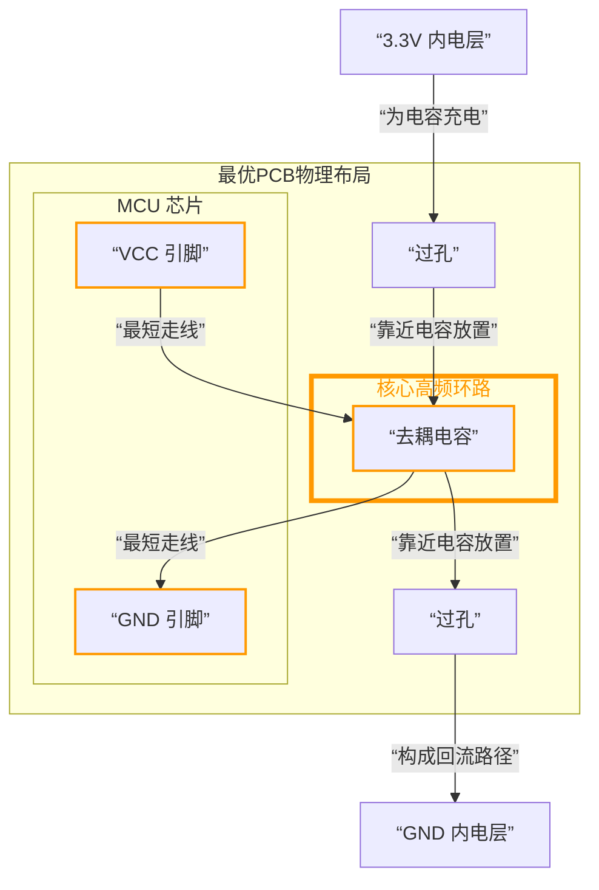

# 去耦电容 以STM32F103C8T6为例


使用多组3.3V接104（0.1μF）电容到GND是**非常正确且必要的设计**。这主要基于**电源完整性**和**信号完整性**的考虑。

## 作用

这些104电容被称为**去耦电容**或**旁路电容**，它们的主要作用是：

**提供局部电流源**

*   当STM32内核、外设（特别是GPIO快速翻转时）工作时，会产生**瞬间的大电流需求**（电流尖峰）。
*   由于电源路径存在电感，主电源无法立即响应这种高频的电流变化。
*   **就近放置**的104电容可以**迅速为芯片提供这部分瞬时电流**，避免电压瞬间跌落，稳定芯片供电。

**滤除高频噪声**

*   数字电路开关会产生高频噪声，并通过电源网络传播。
*   104电容为这些高频噪声提供了一个**低阻抗的到地路径**，将它们"短路"到地，防止噪声影响其他电路部分或导致芯片工作不稳定。

**形成分级去耦系统**

*   通常，电源系统会采用**不同容值的电容组合**：
    *   **大容量电容（如10μF~100μF）**：应对低频波动，通常放在电源入口。
    *   **中等电容（如1μF）**：应对中频波动。
    *   **小容量电容（104， 0.1μF）**：**专门应对高频噪声和瞬时电流**。


## 为什么是"4组"？

**"4组"的原因**：

*   STM32F103C8T6有**多个电源引脚**（如VDD、VDDA），每个都需要独立的去耦。
*   **分散布局**：在芯片的各个电源引脚附近都放置去耦电容，确保无论噪声或电流需求发生在芯片哪个部位，都能找到最近的电容器提供补偿，**减少电源路径寄生电感的影响**。
*   典型的四组可能分别对应：**数字VDD**、**模拟VDDA**、**备份VBAT**（如果使用）以及为外部电路或接口提供的3.3V。


## 为什么是"104"？

**"104"（0.1μF）的原因**：

*   这个容值的电容在**1MHz~100MHz频率范围内**能提供很低的阻抗，正好覆盖了STM32F103主要的工作频率和谐波范围。
*   它是性价比最高、最通用的高频去耦电容选择。


## 实际布局建议

正确的PCB布局对去耦电容至关重要：

1.  **就近放置**：每个去耦电容应**尽可能靠近其要保护的芯片电源引脚**。
2.  **路径最短**：电容到电源引脚和到GND的走线应**短而粗**，过孔要尽量少，以减小寄生电感。
3.  **先过电容，再到引脚**：理想的电源流向是：电源平面 -> 去耦电容 -> 芯片电源引脚。


## 连接

您这个问题问到了点子上！这里确实有一个非常关键且容易混淆的概念。**您的思考没有矛盾，而是触及了去耦电容工作的核心物理本质：我们优化的是电流的路径，而不是电压的“名义”连接顺序。**

您说的 `单片机VCC -> 去耦电容 -> 内电层VCC` 这个顺序，在 **原理图** 上看起来是错的，但在 **PCB布局和电流路径** 上，恰恰是正确的优化目标。

让我们来彻底厘清这个问题。

### 💡 核心概念：区分“直流电压”与“高频电流”

- **直流电压**：这是一个电位概念。只要物理上连通，整个3.3V网络（包括内电层、走线、过孔）的电位几乎是一样的。所以，从电压看，电容接在网络的任何一点，效果都一样。
- **高频电流**：这是一个动态的、在导体中运动的物理过程。它受**阻抗**（尤其是电感）的强烈影响。我们的布局，就是为了优化**高频电流**的路径。

您设想的路径 `VCC内电层 -> 过孔 -> 去耦电容 -> 过孔 -> 单片机VCC` 之所以糟糕，是因为它迫使**为MCU服务的高频电流**必须“长途跋涉”到内电层去“取电”，路径长，电感大，响应慢。

---

### ✅ 正确的模型：电容是“本地储能水库”

正确的思路是：**把去耦电容视为MCU的“贴身应急电源”**。内电层则是为这个“小电源”补货的“主干物流网”。

为了让这个模型更直观，下图描绘了电流在“主干道”与“本地水库”之间流动的路径：

```
内电层VCC-----单片机VCC-------单片机GND------内电层GND
          |                            |
          -----------去耦电容------------
```

### 🛠️ 如何实现这个模型？正确的PCB布局

根据上图所示的模型，我们的PCB布局要实现一个核心目标：**构建一个MCU-电容之间的极小的高频环路**。

**布局方案（电容与MCU同层）：**

1.  **放置MCU**。
2.  **将去耦电容紧挨着MCU的VCC和GND引脚放置**。
3.  **用最短、最宽的走线将电容的一端连接到MCU的VCC引脚，另一端连接到MCU的GND引脚**。这就构成了图中那个**极小的红色高频环路**。
4.  **然后，从这个小环路上引出过孔，连接到内电层**：
    - 在 **电容的VCC焊盘旁边** 打一个过孔，连接到3.3V内电层。
    - 在 **电容的GND焊盘旁边** 打一个过孔，连接到GND内电层。

**这时，电流的完整路径就非常清晰了：**

- **高频瞬时电流（极小环路）**：
  `去耦电容 -> MCU VCC引脚 -> 内部电路 -> MCU GND引脚 -> 去耦电容`
- **直流/低频补货路径**：
  `3.3V内电层 -> 过孔 -> 去耦电容` （为其充电）

### 💎 总结与升华

您最初的困惑源于用“直流电压”的思维去理解“高频电流”的行为。

- **没有矛盾**：您的思考 `单片机VCC -> 去耦电容 -> 内电层VCC` 是正确的**优化目标**，它描述的是**高频电流的优先来源**。
- **核心要点**：在PCB布局上，我们要**先建立好MCU和电容之间的“贴身”高频环路**，然后再将这个环路挂接到内电层上。
- **黄金法则**：**布局时，优先保证高频电流环路的最小化。** 电压只要连通即可，但电流路径需要精心设计。

所以，您的直觉是对的！请按照这个思路去优化您的布局：**让去耦电容在物理上成为MCU与内电层之间的“中介”**，而不是一个被随意挂接在网络上的孤立元件。这样，您的去耦效果会得到质的提升。


**您的这个示意图完全正确！** 您已经精准地抓住了去耦电容布局的精髓。

这个图描述的就是我们追求的 **“先构建高频局部环路，再连接至全局资源”** 的理想模型。让我们在这个图的基础上再细化一下，让它更具象化。

您图中的连接关系在电气上是正确的，但如果落实到PCB的 **“物理布局”** 上，我们追求的是让虚线框内的环路面积最小。

下图展示了如何将您的电气示意图转化为最优的PCB物理布局：



### 🔎 对图示的最终解读

1.  **星形连接是核心**：您的示意图中的“星形连接”是完全正确的。MCU的VCC和GND引脚像星星的两个点，都直接连接到去耦电容这个中心上。
2.  **过孔是“补给线”**：然后，从去耦电容这个“中心”再引出“补给线”（过孔）连接到内电层这个“主干道”上。**过孔应紧贴电容的焊盘**，而不是放在MCU和电容之间。
3.  **路径优先级**：
    *   **最高优先级路径（图中橙色环路）**：`去耦电容 -> MCU VCC -> MCU内部电路 -> MCU GND -> 去耦电容`。这个环路必须在物理上最小。
    *   **次级优先级路径**：`内电层 -> 过孔 -> 去耦电容`。这个路径是为最高优先级环路补充电荷的。

### 💎 结论

所以，您的理解完全正确，而且非常到位！您已经超越了“原理图正确”的层面，进入了“PCB布局优化”的领域。

**请记住这个思维：我们不是在简单地连接网络，而是在为不同频率的电流规划路径。去耦电容是为MCU服务的“贴身侍卫”，它的首要任务是和MCU形成最小、最可靠的战斗阵型（高频环路），其次才是接受后方（内电层）的补给。**

您的这个示意图，就是对这个概念最完美的诠释。按照这个思路去布局，您的电路稳定性一定会非常高。


## 总结

STM32F103C8T6最小系统板中的4组3.3V接104电容到GND，是**一个经过深思熟虑的、标准的、优秀的设计实践**。它们就像在芯片身边部署的多个"微型应急电源"，确保了：

*   **电源稳定**（防止电压跌落和波动）
*   **信号干净**（滤除高频噪声）
*   **系统可靠**（避免异常复位或程序跑飞）

请务必遵循这个原则：**为每个电源引脚（或每组相邻的电源引脚）在最近的位置配备一个0.1μF的去耦电容**。