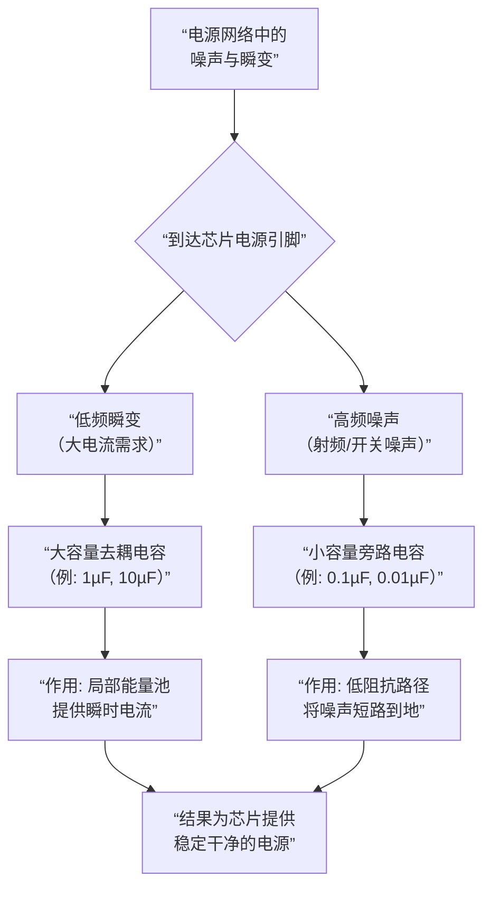

## 电容在电路中的主要作用

**去耦 / 旁路**

*   **目的**：为芯片提供局部的、纯净的电源。
*   **原理**：数字芯片在开关瞬间会产生急剧的电流需求，引起电源网络的微小波动。就近放置的去耦电容（通常是0.1µF瓷片电容）可以迅速为芯片提供这部分瞬时电流，避免电压跌落，同时将高频噪声短路到地。
*   **布局**：**必须靠近芯片的电源引脚**。

**电源滤波**

*   **目的**：将脉动的直流电（如整流后）平滑成稳定的直流电。
*   **原理**：利用电容的充放电特性，在电压高时储存能量，在电压低时释放能量，填补电压的“波谷”。通常使用大容量的电解电容。

**信号耦合**

*   **目的**：将前级电路的交流信号传递到后级，同时隔离两级之间的直流偏置电压。
*   **原理**：利用“隔直通交”的特性。常见于音频放大器和射频电路。

**定时 / 振荡**

*   **目的**：与电阻一起构成RC电路，决定时间常数，用于产生延时或特定频率的振荡信号。

**储能**

*   **目的**：像一个小电池一样储存能量，并在需要时释放。
*   **应用**：相机闪光灯、超级电容的应用。

**

**

**去耦** 和 **旁路** 的核心目标是一致的：**消除电源网络上的噪声，为芯片提供一个局部、稳定、干净的电源**。

### 去耦电容

**解决的问题：**

芯片（尤其是数字芯片如CPU、FPGA、MCU）在内部晶体管开关的瞬间，会产生一个**急剧、短暂**的电流需求（称为**ΔI噪声** 或 **开关噪声**）。这个电流尖峰如果全部从远处的电源模块获取，会因路径上的电感（PCB走线本身就有电感）而产生电压跌落（`ΔV = L * di/dt`），导致芯片的电源引脚电压瞬间降低，这可能导致芯片工作不稳定甚至逻辑错误。

**工作原理：**

在芯片旁边放置一个去耦电容，它就相当于一个**局部的、微型的“能量水池”**或 **“充电宝”**。

*   **当芯片不开关时**：电源缓慢地为这个电容充电。
*   **当芯片突然需要大电流时**：远处的电源来不及响应，此时，**去耦电容会立即放电**，在极短的时间内为芯片提供所需的瞬时电流。由于它离芯片非常近，路径电感极小，可以有效抑制电源引脚的电压波动。

**关键特点：**

*   **应对对象**：低频、瞬态的大电流需求。
*   **电容值**：通常较大，如 **10µF, 1µF, 0.1µF**。在实际设计中，通常会采用 **“大电容 + 小电容”** 的组合（例如一个1µF和一个0.1µF并联），大电容负责低频范围的能量缓冲，小电容负责响应更快的高频成分。
*   **布局要求**：**必须尽可能靠近芯片的电源引脚**。距离越远，效果越差！


### 旁路电容

**1. 解决的问题：**
电路板上存在各种高频噪声（来自时钟信号、RF辐射、开关电源的振铃等）。这些噪声会通过辐射或传导的方式耦合到电源网络上。如果这些高频噪声进入芯片的电源引脚，会干扰芯片内部敏感模拟电路（如运放、PLL）或导致数字电路产生误动作。

**2. 工作原理：**
旁路电容的作用是**为高频噪声提供一个低阻抗的“捷径”**，使其在到达芯片之前就被“分流”到地，而不是进入芯片。

*   根据容抗公式 `Xc = 1 / (2πfC)`，对于高频信号（`f`很大），即使是很小的电容，其容抗也非常低。
*   因此，对于高频噪声来说，旁路电容相当于一根 **“短路到地”** 的导线，将其有效滤除。

**3. 关键特点：**

*   **应对对象**：高频噪声。
*   **电容值**：通常较小，如 **0.1µF (100nF), 0.01µF (10nF)**。这些小电容的谐振频率更高，在高频段呈现更低的阻抗。
*   **布局要求**：同样，**必须尽可能靠近芯片的电源引脚**。

---

### 总结与对比

为了更直观地理解它们的协同工作方式，可以参考下面的流程图，它展示了一个典型的芯片电源引脚处，不同电容是如何分工协作的：



**结论：**
在现代电子设计中，“去耦”和“旁路”通常指的是同一组电容，它们**协同工作，各司其职**。我们放置的那些紧靠芯片电源引脚的 **0.1µF** 电容，同时扮演着**高频噪声的旁路器**和**高频瞬态电流的去耦器**双重角色。

因此，一个简单而重要的实践是：**为你板子上的每一个重要芯片的每一个电源引脚，都尽可能地靠近放置一个（通常是0.1µF的）电容。** 这是保证电路稳定可靠运行的最具性价比的措施之一。

# 1

```

```

