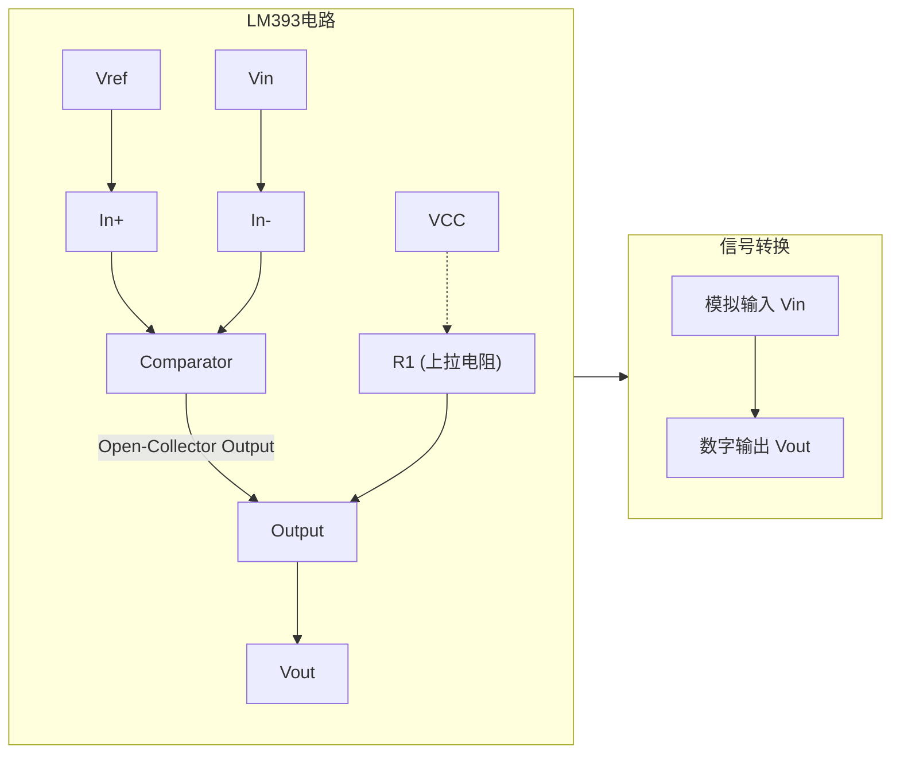
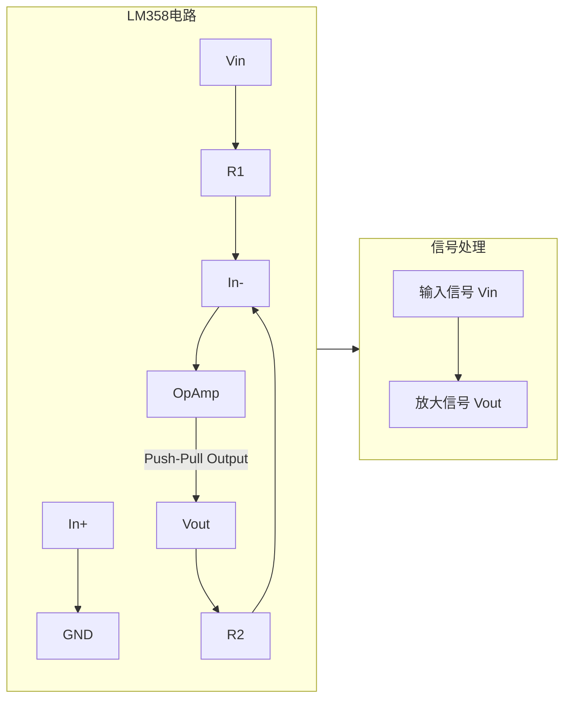

# LM393与LM358

## 核心区别

最核心的区别是：

*   **LM393是电压比较器**，输出是**数字信号**（高电平或低电平）。
*   **LM358是运算放大器**，输出是**模拟信号**，通常工作在线性区。

| 特性维度     | LM393 (双路电压比较器)                                       | LM358 (双路运算放大器)                                       |
| :----------- | :----------------------------------------------------------- | :----------------------------------------------------------- |
| **核心功能** | **比较两个电压**，输出数字信号                               | **放大电压差**，输出模拟信号                                 |
| **输出类型** | **开集电极输出**                                             | **推挽输出**                                                 |
| **输出电平** | 输出低电平时：内部晶体管导通，电压约0.2V<br>输出高电平时：**内部晶体管截止，靠外部上拉电阻到VCC** | 输出可跟随输入变化，**主动输出高电平或低电平**，高电平可达VCC-1.5V左右 |
| **工作模式** | **非线性（开关状态）**                                       | **线性（放大状态）** 或非线性（需加反馈）                    |
| **反馈连接** | **不需要反馈**，或仅用于迟滞（正反馈）                       | **必须接负反馈**才能稳定工作在线性区                         |
| **典型应用** | 电平检测、过零检测、窗口比较器、波形整形                     | 信号放大、电压跟随器、有源滤波器、加减法运算电路             |
| **输出连接** | 多个输出可以**直接并联**（线与逻辑）                         | 输出**不能直接并联**                                         |


### 深入解析关键区别

#### 1. 输出结构：根本性差异

这是理解两者所有区别的关键。

*   **LM393（开集电极输出）**：
    它的输出端相当于一个开关到地的晶体管（集电极开路）。当反相输入端电压(-) > 同相输入端电压(+)时，晶体管导通，将输出**拉低**到地（GND）。当(-) < (+)时，晶体管**关闭**，输出端呈现**高阻抗状态**。
    **因此，要得到高电平，必须在输出端和正电源(VCC)之间连接一个上拉电阻。** 没有这个电阻，输出高电平时就没有确定的电压。

    **电路示意图：**
    ```
          VCC
          |
         [R]   <--- 上拉电阻 (必须外部连接)
          |
          +--- OUT
          |
    Internal Transistor --- GND (内部晶体管，受比较结果控制)
    ```

*   **LM358（推挽输出）**：
    它的输出级有一对推挽晶体管（一个上拉，一个下拉），可以**主动地**向负载提供或从负载吸取电流。因此它不需要外部上拉电阻，可以直接输出一个在一定范围内连续变化的电压。

#### 2. 应用电路实例对比

**案例一：电平检测器（使用LM393）**



这是一个典型的比较器应用。当模拟输入电压 `Vin` 低于参考电压 `Vref` 时，输出为高电平（由 `VCC` 通过上拉电阻 `R1` 提供）。当 `Vin` 高于 `Vref` 时，输出被内部晶体管拉低到地。这样，模拟信号就被转换成了数字信号。

**案例二：反相放大器（使用LM358）**



这是一个标准的运放电路。通过负反馈电阻 `R2` 和输入电阻 `R1` 的比值，决定了电路的放大倍数 `Av = -R2/R1`。运放工作在线性区，输出一个与输入成线性比例的、被放大的模拟电压。

### 总结与选型指南

| 场景                                                         | 应该选择                              |
| :----------------------------------------------------------- | :------------------------------------ |
| 你需要判断一个电压是否超过/低于某个阈值（如电池欠压保护、光控开关、过温保护） | **LM393**                             |
| 你需要将一个微弱的信号进行放大（如传感器信号放大、音频前置放大） | **LM358**                             |
| 你需要产生一个方波、实现波形整形                             | **LM393**                             |
| 你需要做一个电压跟随器（提高输入阻抗、降低输出阻抗）         | **LM358**                             |
| 你的输出需要驱动一个LED或继电器，并且控制端是接地有效        | **LM393**（因其开集输出易于接地驱动） |
| 你的电路需要输出一个连续可变的电压                           | **LM358**                             |

**一句话总结：用LM393做“判决”，用LM358做“放大”。** 记住这个核心原则，你就不会再混淆它们了。