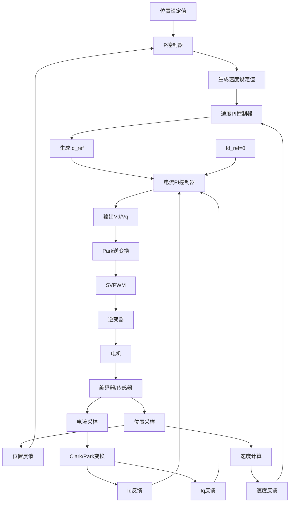

# 级联控制（Cascaded Control）

FOC的速度控制不是一个单一的环路，而是一个经典的**三闭环级联控制结构**。这是理解其理论的关键。这三个环从内到外分别是：

1.  **电流环（最内环）**
2.  **速度环（中间环）**
3.  **位置环（最外环，可选）**

**级联控制的原理是：外环控制器的输出，作为内环控制器的设定值（目标）。内环负责“快速响应”，外环负责“宏观精确”。**

## 速度闭环系统

一个典型的带速度闭环的FOC系统结构如下图所示，清晰地展示了信号的流向和三个环路的关系：

上述流程可以概括为以下步骤：

1.  **外环设定**：用户给出一个目标速度（`Speed_Ref`）。
2.  **速度环计算**：
    *   通过编码器等传感器测量电机的实际速度（`Speed_Measured`）。
    *   **速度控制器（通常为PI控制器）** 计算目标速度与实际速度的误差（`Err_speed`）。
    *   PI控制器根据这个误差输出一个值，这个值**直接作为q轴电流（Iq）的给定值（`Iq_Ref`）**。因为Iq直接对应转矩，所以速度环的输出本质是一个“目标转矩”。
3.  **电流环计算**：
    *   `Iq_Ref` 和 `Id_Ref`（通常设为0，除非需要进行弱磁控制）被送入**电流控制器（通常为PI控制器）**。
    *   同时，通过采样电阻测量电机的三相电流，经过Clark和Park变换后，得到旋转坐标系下的实际电流值（`Id_Measured`和`Iq_Measured`）。
    *   电流PI控制器计算误差后，输出对应的电压矢量（Vd, Vq）。
4.  **逆变换与驱动**：
    *   将（Vd, Vq）通过**Park逆变换**转换回静止坐标系（α, β）。
    *   再通过**SVPWM（空间矢量脉冲宽度调制）** 算法，生成6路PWM波驱动三相逆变桥，从而精确控制电机三相绕组的电压和电流。
5.  **反馈闭环**：
    *   电机开始转动，编码器持续测量新的转子位置和速度，开始新一轮的循环控制。

整个流程以极高的频率（通常为10kHz ~ 20kHz）不断重复，使得电机的实际速度能够快速、稳定地跟踪目标速度。

