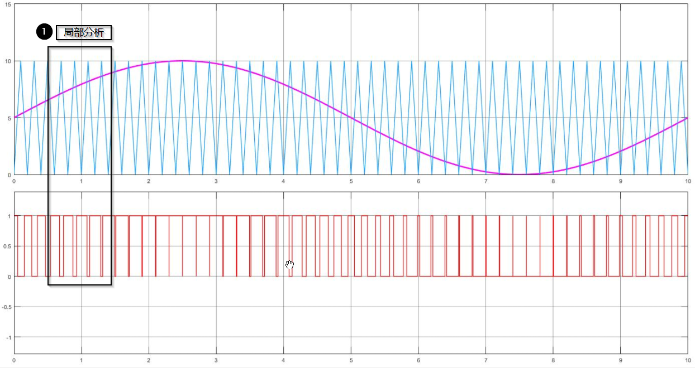
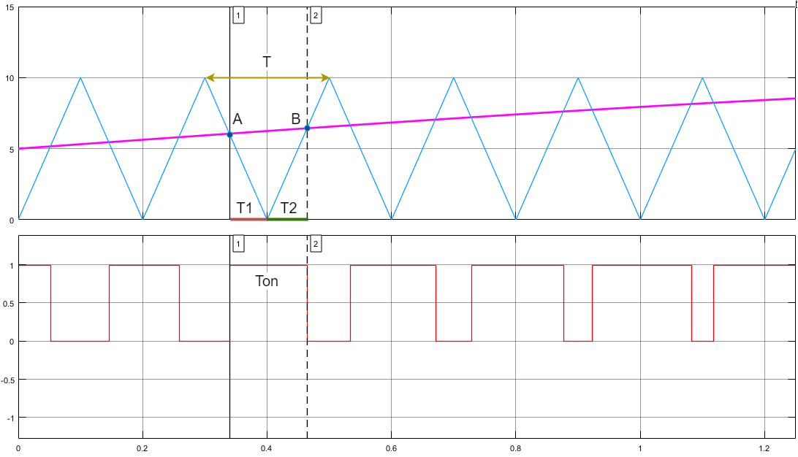
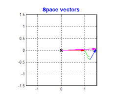

# PWM

## 脉冲宽度调制 PWM

PWM 是一种**利用数字信号（通常是方波）来模拟模拟信号电平**的技术。它的核心思想不是直接改变信号的电压幅度，而是通过**快速开关一个数字信号**，并**精确控制每个周期内“开”（高电平）状态相对于“关”（低电平）状态的时间比例**，来产生一个**等效的平均电压或功率**输出。

基本原理就是面积等效原理，即冲量相等而形状不同的窄脉冲加在具有惯性的环节上时，其效果基本相同 。

**PWM 的关键参数：**

1. **频率：**指 PWM 信号**每秒完成完整开关周期的次数**，单位是赫兹 (Hz)。
2. **周期：**一个完整开关循环（从“开”开始，到“关”，再回到“开”）所需的时间，是**频率的倒数**。单位是秒 (s)。`周期 = 1 / 频率`
3. **脉冲宽度：**在一个周期内，信号处于**高电平（“开”）状态的时间长度**。单位是秒 (s)。
4. **占空比：**这是 PWM **最核心的概念**，表示**一个周期内，高电平时间所占的百分比**。
   - 计算公式：`占空比 = (脉冲宽度 / 周期) * 100%`
   - 占空比范围是 **0% 到 100%**。
     - **0% 占空比**：信号始终为低电平（关），平均电压为 0。
     - **100% 占空比**：信号始终为高电平（开），平均电压等于电源电压。
     - **50% 占空比**：高电平和低电平时间相等，平均电压是电源电压的一半。

## 正弦脉宽调制 SPWM

专门用于生成**高质量的正弦波交流电压或电流**。它是现代电力电子，尤其是**逆变器（DC-AC转换）** 和**变频驱动（VFD）** 技术的核心。

通过**高频三角载波**与**低频正弦调制波**比较，生成宽度按正弦规律变化的脉冲序列，驱动功率开关管，使输出电压逼近正弦波。

SPWM 的基本原理是：**将一个希望得到的正弦波（称为调制波或参考波）与一个高频三角波（称为载波）进行比较，用比较结果来控制功率开关器件的通断。**





**基本属性包含**：

1. **调制波：** 这是你**希望输出的正弦波**。它的频率 `f_ref` 决定了最终输出交流电的频率（例如 50Hz 或 60Hz 工频，或者电机控制需要的可变频率）。它的幅值 `A_ref` 决定了最终输出正弦波的幅值。
2. **载波：** 这是一个**高频三角波**。它的频率 `f_carrier` 远高于调制波频率（通常高几十倍甚至几百倍以上，比如 1kHz 到 20kHz 或更高）。它的幅值通常固定。载波频率决定了 SPWM 脉冲的开关频率。
3. **比较器：** 将正弦调制波和三角载波输入一个比较器。
4. **生成 SPWM 脉冲：**
   - 当**正弦波瞬时值 > 三角波瞬时值**时，比较器输出 **高电平**，驱动对应的开关器件**导通**。
   - 当**正弦波瞬时值 < 三角波瞬时值**时，比较器输出 **低电平**，驱动对应的开关器件**关断**。
   - 这样，就在比较器的输出端产生了一系列**宽度不等的脉冲**。这些脉冲的宽度**紧密跟随正弦调制波的瞬时幅值变化**。

**可以到到：**

- 在**正弦波峰值附近**，正弦波值长时间大于三角波值，产生的**脉冲很宽**。
- 在**正弦波过零点附近**，正弦波值长时间小于三角波值，产生的**脉冲很窄**，甚至没有脉冲（占空比接近0%）。
- 随着正弦波幅值从零到正峰值再到负峰值变化，脉冲宽度也相应地由窄变宽再变窄。**脉冲宽度的包络线就是一个正弦波**。

### DMA+PWM=伪SPWM

通过DMA搬运数据可以达到伪SPWM效果。

提供256成员的12位正弦查找表：

```C
uint16_t sin_table_12bit[] = {0, 50, 100, 151, 201, 251, 301, 351, 401, 451, 501, 551, 601, 651, 700, 750, 799, 848, 897, 946, 995, 1044, 1092, 1141, 1189, 1237, 1285, 1332, 1380, 1427, 1474, 1521, 1567, 1613, 1659, 1705, 1751, 1796, 1841, 1886, 1930, 1975, 2018, 2062, 2105, 2148, 2191, 2233, 2275, 2317, 2358, 2399, 2439, 2480, 2519, 2559, 2598, 2636, 2675, 2713, 2750, 2787, 2824, 2860, 2896, 2931, 2966, 3000, 3034, 3068, 3101, 3133, 3165, 3197, 3228, 3259, 3289, 3319, 3348, 3377, 3405, 3433, 3460, 3486, 3512, 3538, 3563, 3588, 3611, 3635, 3658, 3680, 3702, 3723, 3744, 3764, 3783, 3802, 3821, 3838, 3856, 3872, 3888, 3904, 3919, 3933, 3947, 3960, 3972, 3984, 3996, 4006, 4016, 4026, 4035, 4043, 4051, 4058, 4064, 4070, 4075, 4080, 4084, 4087, 4090, 4092, 4094, 4095, 4095, 4094, 4092, 4090, 4087, 4084, 4080, 4075, 4070, 4064, 4058, 4051, 4043, 4035, 4026, 4016, 4006, 3996, 3984, 3972, 3960, 3947, 3933, 3919, 3904, 3888, 3872, 3856, 3838, 3821, 3802, 3783, 3764, 3744, 3723, 3702, 3680, 3658, 3635, 3611, 3588, 3563, 3538, 3512, 3486, 3460, 3433, 3405, 3377, 3348, 3319, 3289, 3259, 3228, 3197, 3165, 3133, 3101, 3068, 3034, 3000, 2966, 2931, 2896, 2860, 2824, 2787, 2750, 2713, 2675, 2636, 2598, 2559, 2519, 2480, 2439, 2399, 2358, 2317, 2275, 2233, 2191, 2148, 2105, 2062, 2018, 1975, 1930, 1886, 1841, 1796, 1751, 1705, 1659, 1613, 1567, 1521, 1474, 1427, 1380, 1332, 1285, 1237, 1189, 1141, 1092, 1044, 995, 946, 897, 848, 799, 750, 700, 651, 601, 551, 501, 451, 401, 351, 301, 251, 201, 151, 100, 50, 0};
//一共256个成员
//该正弦查找表左右对称
```

提供512成员的12位正弦查找表：

```c
uint32_t sin_table_12bit[512] = {0, 25, 50, 75, 100, 126, 151, 176, 201, 226, 251, 276, 301, 326, 351, 376, 401, 426, 451, 476, 501, 526, 551, 576, 601, 626, 651, 675, 700, 725, 750, 774, 799, 824, 848, 873, 897, 922, 946, 971, 995, 1019, 1044, 1068, 1092, 1116, 1141, 1165, 1189, 1213, 1237, 1261, 1285, 1308, 1332, 1356, 1380, 1403, 1427, 1450, 1474, 1497, 1521, 1544, 1567, 1590, 1613, 1636, 1659, 1682, 1705, 1728, 1751, 1774, 1796, 1819, 1841, 1864, 1886, 1908, 1930, 1952, 1975, 1997, 2018, 2040, 2062, 2084, 2105, 2127, 2148, 2170, 2191, 2212, 2233, 2254, 2275, 2296, 2317, 2337, 2358, 2378, 2399, 2419, 2439, 2460, 2480, 2500, 2519, 2539, 2559, 2578, 2598, 2617, 2636, 2656, 2675, 2694, 2713, 2731, 2750, 2769, 2787, 2805, 2824, 2842, 2860, 2878, 2896, 2913, 2931, 2948, 2966, 2983, 3000, 3017, 3034, 3051, 3068, 3084, 3101, 3117, 3133, 3149, 3165, 3181, 3197, 3213, 3228, 3244, 3259, 3274, 3289, 3304, 3319, 3333, 3348, 3362, 3377, 3391, 3405, 3419, 3433, 3446, 3460, 3473, 3486, 3499, 3512, 3525, 3538, 3551, 3563, 3575, 3588, 3600, 3611, 3623, 3635, 3646, 3658, 3669, 3680, 3691, 3702, 3713, 3723, 3733, 3744, 3754, 3764, 3774, 3783, 3793, 3802, 3811, 3821, 3830, 3838, 3847, 3856, 3864, 3872, 3880, 3888, 3896, 3904, 3911, 3919, 3926, 3933, 3940, 3947, 3953, 3960, 3966, 3972, 3978, 3984, 3990, 3996, 4001, 4006, 4011, 4016, 4021, 4026, 4030, 4035, 4039, 4043, 4047, 4051, 4054, 4058, 4061, 4064, 4067, 4070, 4073, 4075, 4078, 4080, 4082, 4084, 4086, 4087, 4089, 4090, 4091, 4092, 4093, 4094, 4094, 4095, 4095, 4095, 4095, 4095, 4094, 4094, 4093, 4092, 4091, 4090, 4089, 4087, 4086, 4084, 4082, 4080, 4078, 4075, 4073, 4070, 4067, 4064, 4061, 4058, 4054, 4051, 4047, 4043, 4039, 4035, 4030, 4026, 4021, 4016, 4011, 4006, 4001, 3996, 3990, 3984, 3978, 3972, 3966, 3960, 3953, 3947, 3940, 3933, 3926, 3919, 3911, 3904, 3896, 3888, 3880, 3872, 3864, 3856, 3847, 3838, 3830, 3821, 3811, 3802, 3793, 3783, 3774, 3764, 3754, 3744, 3733, 3723, 3713, 3702, 3691, 3680, 3669, 3658, 3646, 3635, 3623, 3611, 3600, 3588, 3575, 3563, 3551, 3538, 3525, 3512, 3499, 3486, 3473, 3460, 3446, 3433, 3419, 3405, 3391, 3377, 3362, 3348, 3333, 3319, 3304, 3289, 3274, 3259, 3244, 3228, 3213, 3197, 3181, 3165, 3149, 3133, 3117, 3101, 3084, 3068, 3051, 3034, 3017, 3000, 2983, 2966, 2948, 2931, 2913, 2896, 2878, 2860, 2842, 2824, 2805, 2787, 2769, 2750, 2731, 2713, 2694, 2675, 2656, 2636, 2617, 2598, 2578, 2559, 2539, 2519, 2500, 2480, 2460, 2439, 2419, 2399, 2378, 2358, 2337, 2317, 2296, 2275, 2254, 2233, 2212, 2191, 2170, 2148, 2127, 2105, 2084, 2062, 2040, 2018, 1997, 1975, 1952, 1930, 1908, 1886, 1864, 1841, 1819, 1796, 1774, 1751, 1728, 1705, 1682, 1659, 1636, 1613, 1590, 1567, 1544, 1521, 1497, 1474, 1450, 1427, 1403, 1380, 1356, 1332, 1308, 1285, 1261, 1237, 1213, 1189, 1165, 1141, 1116, 1092, 1068, 1044, 1019, 995, 971, 946, 922, 897, 873, 848, 824, 799, 774, 750, 725, 700, 675, 651, 626, 601, 576, 551, 526, 501, 476, 451, 426, 401, 376, 351, 326, 301, 276, 251, 226, 201, 176, 151, 126, 100, 75, 50, 25};
```


## 空间矢量脉宽调制 SVPWM

通过互差120°，大小随时间正弦变化的三个分矢量合成一个大小不变旋转的总矢量。

材料：

A：红色

B：绿色

C：蓝色

结果：

紫色




## PWM


## PWM