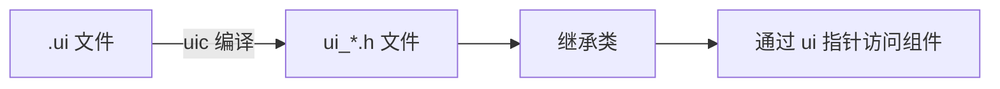

# UI组件代码关联

## 基本流程概述

在 Qt 中，`.ui` 文件（XML 格式的界面描述文件）需要通过 **uic**（User Interface Compiler）工具转换为 C++ 代码，然后才能在 `.cpp` 和 `.h` 文件中访问其中的组件。



## 详细步骤

1. ### 创建 .ui 文件

在 Qt Designer 中设计界面，保存为 `mainwindow.ui`（例如包含一个按钮 **`pushButton`** 和一个文本框 **`lineEdit`**）。

2. #### 项目配置（.pro 文件）

确保 `.pro` 文件包含 UI 文件：
```qmake
QT       += core gui
TARGET   = MyApp
SOURCES += main.cpp mainwindow.cpp
HEADERS += mainwindow.h
FORMS   += mainwindow.ui  # 关键：声明 UI 文件
```

3. #### 自动生成 ui_*.h 文件

Qt 构建系统会自动调用 uic 工具生成 `ui_mainwindow.h`（存储在构建目录中）。

4. #### 在头文件中声明 mainwindow.h

```cpp
#ifndef MAINWINDOW_H
#define MAINWINDOW_H

#include <QMainWindow>

// 前置声明 UI 命名空间
namespace Ui {
class MainWindow;  // 对应 ui_mainwindow.h 中的类
}

class MainWindow : public QMainWindow
{
    Q_OBJECT// 本质是一个已定义好的宏，所有需要“信号和槽”功能的组件都必须将 Q_OBJECT 作为 private 属性成员引入到类中。
public://公有成员函数 (接口)
    explicit MainWindow(QWidget *parent = nullptr);//构造函数
    ~MainWindow();//析构函数

private slots:// 声明一个或多个槽函数，并且这些槽函数是类的私有成员。
    void onButtonClicked();  // 自定义槽函数

private:// 私有成员变量 (实现细节)
    Ui::MainWindow *ui;  // 关键：UI 指针
};

#endif // MAINWINDOW_H
```

5. #### 在源文件中实现 mainwindow.cpp

```cpp
#include "mainwindow.h"
#include "ui_mainwindow.h"  // 关键：包含自动生成的头文件

MainWindow::MainWindow(QWidget *parent) : QMainWindow(parent), ui(new Ui::MainWindow)  // 创建 UI 实例
{
    ui->setupUi(this);  // 关键：初始化界面
    // 通过 ui 指针访问组件
    ui->lineEdit->setPlaceholderText("输入内容");
    // 信号槽连接（两种方式）

    // 方式1：自动连接（需遵循命名规范）
    // 槽函数名必须为：on_组件名_信号名()
    // 例如：on_pushButton_clicked()
    
    // 方式2：手动连接
    connect(ui->pushButton, &QPushButton::clicked,
            this, &MainWindow::onButtonClicked);
}

MainWindow::~MainWindow()
{
    delete ui;  // 清理 UI 实例
}

// 自定义槽函数实现
void MainWindow::onButtonClicked()
{
    QString text = ui->lineEdit->text();
    qDebug() << "输入内容：" << text;
    
    // 修改组件属性
    ui->pushButton->setText("已点击");
}
```

---

### **3. 访问 UI 组件的两种方式**

#### **方式 1：通过 ui 指针直接访问（推荐）**
```cpp
// 获取组件
QPushButton *button = ui->pushButton;

// 设置属性
ui->lineEdit->setText("Hello");

// 连接信号
connect(ui->pushButton, SIGNAL(clicked()), this, SLOT(handleClick()));
```

#### **方式 2：自动连接槽函数（需严格命名）**
```cpp
// 在头文件中声明
private slots:
    void on_pushButton_clicked();  // 命名规则：on_<objectName>_<signalName>

// 在cpp中实现
void MainWindow::on_pushButton_clicked()
{
    // 自动关联到 pushButton 的 clicked() 信号
}
```

---

### **4. 动态修改 UI 组件**

#### **添加新组件**
```cpp
// 在已有布局中添加新按钮
QPushButton *newBtn = new QPushButton("动态按钮", this);
ui->verticalLayout->addWidget(newBtn);  // 添加到UI中的布局
```

#### **访问嵌套组件**
```cpp
// 访问分组框中的复选框
QCheckBox *check = ui->groupBox->findChild<QCheckBox*>("checkBoxName");
if(check) {
    check->setChecked(true);
}
```

---

### **5. 重要注意事项**

1. **ui 指针的生命周期**
   - 在构造函数中初始化：`ui(new Ui::MainWindow)`
   - 在析构函数中释放：`delete ui`

2. **命名一致性**
   - UI 文件中的 `objectName` 必须与代码中的标识符一致
   - 修改 UI 后需重新编译项目

3. **自动生成文件位置**
   - `ui_*.h` 在构建目录（如 `build-*`）中生成
   - 不要手动修改这些文件

4. **自定义组件扩展**
   ```cpp
   // 在MainWindow类中添加自定义成员
   private:
       Ui::MainWindow *ui;
       QTimer *customTimer;  // 自定义组件
   ```

---

### **6. 常见问题解决**

#### **问题：无法访问 UI 组件**
- 检查 `ui->setupUi(this)` 是否调用
- 确认 UI 文件中的 `objectName` 拼写正确
- 清理并重新构建项目

#### **问题：自动连接槽无效**
- 确认槽函数命名完全匹配：`on_<objectName>_<signalName>`
- 检查信号是否拼写正确（如 `clicked()` 不是 `pressed()`）

#### **问题：内存泄漏**
- 确保在析构函数中 `delete ui`
- 动态创建的组件应指定父对象

---

### **7. 最佳实践建议**

1. **封装访问逻辑**
   ```cpp
   // 在MainWindow类中添加访问方法
   QString getInputText() const {
       return ui->lineEdit->text();
   }
   ```

2. **使用信号转发**
   ```cpp
   // 转发UI组件的信号
   connect(ui->slider, &QSlider::valueChanged,
           this, &MainWindow::onValueChanged);
   ```

3. **分离业务逻辑**
   - 避免在 `MainWindow` 中堆积过多逻辑
   - 将功能拆分为独立的类/模块

通过这种机制，Qt 实现了界面设计与业务逻辑的优雅分离，是 Qt 框架的核心优势之一。