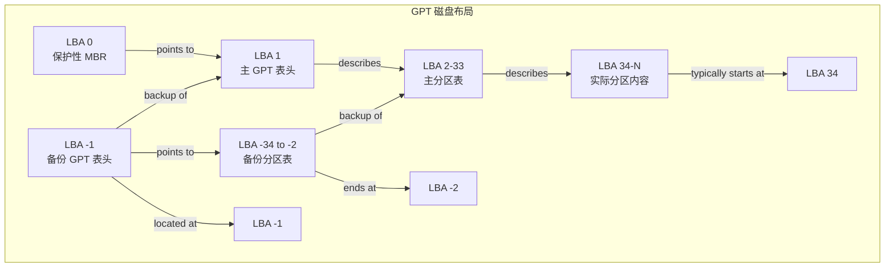

# GPT (GUID Partition Table)

GPT 是现代计算机硬盘分区的事实标准，它克服了传统 MBR 的所有主要缺陷，是与 UEFI (统一可扩展固件接口) 固件相辅相成的关键技术。

## MBR 的局限性

要理解 GPT 的优势，必须先回顾 MBR 的不足：

1.  **容量限制**： MBR 使用 32 位存储扇区地址，最大只能支持 2^32 * 512 字节 ≈ **2.2 TB** 的磁盘。超过此容量的磁盘，MBR 无法管理其所有空间。
2.  **分区数量限制**： MBR 的分区表只有 4 个条目，最多只能创建 **4 个主分区**。如需更多分区，必须建立复杂的**扩展分区**和**逻辑分区**结构，其健壮性较差。
3.  **可靠性差**： MBR 的分区表和引导代码**只有一个副本**，存储在同一扇区。如果这个扇区损坏（病毒、误操作、磁盘坏道），整个磁盘的分区信息将丢失，导致数据难以恢复。
4.  **兼容性**： MBR 本身对现代硬件和固件的特性支持不足。

GPT 的设计目的就是为了彻底解决以上所有问题。

## GPT 是什么？

**GUID Partition Table (GUID 分区表)** 是 UEFI 标准的一部分。其核心特点是：
*   **GUID**： 每个分区都有一个全局唯一的标识符 (Globally Unique Identifier)，这极大地避免了标识冲突。
*   **LBA**： 完全基于逻辑块地址 (Logical Block Address) 进行寻址，不再依赖 CHS (柱面-磁头-扇区) 这种过时的寻址模式。

## 磁盘布局结构

GPT 的布局非常精巧且健壮，其结构如下图所示，它在磁盘的**开头和末尾**都保存了关键信息的副本：

### 保护性 MBR (Protective MBR - LBA 0)
*   **位置**： 磁盘的第一个扇区 (LBA 0)。
*   **目的**： **向后兼容** 并 **保护磁盘**。
    *   **兼容性**： 让那些不认识 GPT 的老旧系统工具（如基于 BIOS 的启动管理器或古老的 `fdisk`）能够识别到这个磁盘“已经被分区了”，而不是一块空盘，从而避免它们试图对磁盘进行重新分区，误操作导致数据丢失。
    *   **实现方式**： 它包含一个类型为 `0xEE` 的分区项，这个项的定义范围是**整个磁盘**。对于不支持 GPT 的系统，它会看到一个大得惊人的 `0xEE` 类型分区，并知道不要动它。

### 主 GPT 表头 (Primary GPT Header - LBA 1)

*   **位置**： 紧接在保护性 MBR 之后 (LBA 1)。
*   **内容**： 包含至关重要的元数据：
    *   **签名**： "EFI PART" 字符串，用于标识这是一个有效的 GPT。
    *   **修订号**： GPT 标准的版本。
    *   **表头大小**： 通常是 92 字节。
    *   **CRC32 校验和**： 用于校验表头本身的完整性。如果校验失败，系统会尝试使用备份表头。
    *   **当前 LBA**： 这个主表头自身的位置 (LBA 1)。
    *   **备份 LBA**： 备份 GPT 表头的位置 (即磁盘最后一个扇区)。
    *   **第一个可用 LBA**： 可用于创建新分区的起始位置。
    *   **最后一个可用 LBA**： 可用于创建新分区的结束位置。
    *   **磁盘 GUID**： 整个磁盘的全局唯一标识符。
    *   **分区表起始 LBA**： 主分区表的起始位置 (通常是 LBA 2)。
    *   **分区条目数**： 分区表中包含的总条目数 (通常是 128)。
    *   **分区条目大小**： 每个分区条目的大小 (通常是 128 字节)。
    *   **分区表 CRC32**： 对整个分区表数组计算的校验和。

### 主分区表 (Primary Partition Table - 通常是 LBA 2 到 33)

*   **位置**： 紧跟在主 GPT 表头之后。通常占用 32 个扇区 (从 LBA 2 到 LBA 33)，这为分区条目提供了充足的空间。
*   **内容**： 一个由**分区条目**组成的数组。每个条目 128 字节，因此 32 个扇区 (32 * 512 = 16384 字节) 可以容纳 **16384 / 128 = 128 个分区**。这就是 Windows 系统默认支持 128 个分区的来源。每个分区条目包含：
    *   **分区类型 GUID**： 标识分区的类型和用途 (如： `C12A7328-F81F-11D2-BA4B-00A0C93EC93B` 代表 EFI 系统分区)。
    *   **唯一分区 GUID**： 这个分区本身的全局唯一 ID。
    *   **起始 LBA**： 分区开始的扇区地址。
    *   **末尾 LBA**： 分区结束的扇区地址。
    *   **属性标志**： 定义分区的属性，如“只读”、“隐藏”、“不自动挂载”等。
    *   **分区名称**： 以 UTF-16LE 编码的分区名称字符串（如 "My Data"），最多 36 个字符，方便用户阅读。

### 实际分区内容

*   从 LBA 34 开始，就是实际分配给各个分区的空间，用于存储文件系统数据。

### 备份分区表 (Backup Partition Table) 和 备份 GPT 表头 (Backup GPT Header)

*   **位置**： **磁盘的最后**。备份分区表位于备份表头之前。
*   **内容**： 备份分区表是**主分区表的逐扇区镜像**。备份 GPT 表头是**主 GPT 表头的精确副本**（除了“当前 LBA”和“备份 LBA”等指针字段需要互换）。
*   **作用**： **提供冗余**。如果磁盘开头的主分区表或主表头因任何原因损坏（如：病毒、坏道），系统固件和操作系统可以**自动使用磁盘末端的备份来恢复信息**。这是 GPT 相比 MBR 在可靠性上的巨大飞跃。

## GPT 的核心优势总结

1.  **巨大的容量支持**： 使用 64 位 LBA 寻址，理论最大支持磁盘容量为 **2^64 * 512 字节**，这是一个天文数字（约 9.4 ZB，1 ZB = 10 亿 TB），足以应对未来数十年的发展需求。

2.  **无限的分区数量**： 分区表大小不再固定为 4 项。理论上，通过调整分区表区域的大小，可以创建任意多的分区。实践中，操作系统会施加限制（如 Windows 的 128 个），但这已远超任何个人用户需求。

3.  **极强的可靠性**：
    *   **CRC 校验**： 表头和分区表都包含 CRC32 校验和，可检测数据是否损坏。
    *   **冗余备份**： 在磁盘末尾存有分区表和表头的完整备份，可实现自我修复。

4.  **全局唯一标识符 (GUID)**： 所有磁盘和分区都有全球唯一的 ID，极大避免了在多磁盘系统中发生标识冲突的风险。

5.  **统一的标准化**： 作为 UEFI 标准的一部分，GPT 得到了硬件、固件和操作系统厂商的广泛统一支持。

## 使用 GPT 的注意事项

*   **操作系统支持**：
    *   **现代操作系统**： 所有版本的 Windows（从 Vista x86_64 / Win7 开始）、Linux、macOS（从 Intel Mac 开始）都完全支持从 GPT 磁盘启动和读写数据。
    *   **传统操作系统**： 古老的 Windows XP 32 位等无法识别 GPT 磁盘。
*   **固件要求**：
    *   要从 GPT 磁盘启动，计算机的**主板固件必须是 UEFI**，而不能是传统的 Legacy BIOS。不过，**数据盘** 使用 GPT 则无此限制，可以在 BIOS 系统上作为从盘使用。
*   **MBR 转换 GPT**： 可以将 MBR 磁盘无损转换为 GPT 磁盘（例如使用 Windows 的 `mbr2gpt.exe` 或 Linux 的 `gdisk`），但操作前**必须备份重要数据**。

总而言之，GPT 是一种设计先进、健壮可靠且面向未来的磁盘分区方案，是现代计算设备（无论是 PC、服务器还是工作站）的绝对首选。对于新购买的硬盘，尤其是容量大于 2TB 的硬盘，GPT 是唯一正确的选择。

