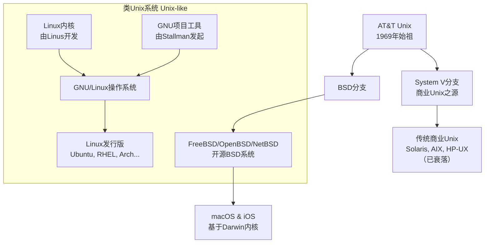

# Unix 和类 Unix 系统介绍

## Unix

### 起源与历史
Unix 诞生于 **1969 年** 的 **AT&T 贝尔实验室**，由肯·汤普森（Ken Thompson）、丹尼斯·里奇（Dennis Ritchie）等人开发。它的诞生源于一个失败的多用户操作系统项目 **Multics**。Unix 的名字（Unics）正是对 Multics 的一种戏谑性简化。

几个关键里程碑：
*   **C 语言的改写**：1973 年，Unix 用丹尼斯·里奇发明的 **C 语言** 重写。这使得 Unix 具有了前所未有的**可移植性**，可以相对容易地移植到不同类型的硬件上，这是它成功的关键。
*   **BSD 的诞生**：加州大学伯克利分校（UCB）推出了 Unix 的另一个重要分支——**BSD（Berkeley Software Distribution）**，为 Unix 增加了许多关键特性，如 TCP/IP 协议栈（互联网的基石）、vi 编辑器、c shell 等。
*   **商业化与版权**：由于 AT&T 开始对 Unix 收费和版权化，引发了各种法律和商业纠纷，但也催生了多个商业 Unix 版本。

### 核心设计哲学
Unix 的成功不仅在于技术，更在于其简洁而强大的哲学：
*   **一切皆文件（Everything is a file）**：硬件设备、进程、网络连接等都被抽象成文件，可以通过统一的读写接口进行操作。
*   **小型、单一目的的程序（Small, single-purpose programs）**：每个程序只做好一件事。
*   **通过管道连接程序（Connect programs together）**：使用管道（`|`）将一个小程序的输出作为另一个小程序的输入，从而组合出复杂的功能。（例如：`ls | grep .txt`）
*   **避免复杂的用户界面（Avoid captive user interfaces）**：偏爱可编写脚本的命令行界面（CLI）而非图形界面（GUI）。
*   **纯文本存储数据（Store data in flat text files）**：文本文件是通用的、可读的、可移植的。

### 主要的传统商业Unix（逐渐衰落）
这些是直接源自原始 AT&T Unix 代码的商业版本，如今大多已成历史或市场份额极小。
*   **Solaris** (由 Sun Microsystems 开发，后被 Oracle 收购)
*   **AIX** (由 IBM 开发，用于其 Power 服务器)
*   **HP-UX** (由 Hewlett-Packard 开发)
*   **IRIX** (由 Silicon Graphics 开发)

---

## 类 Unix 系统（Unix-like）

这类系统**并非直接源自 AT&T 的源代码**，但要么遵循 Unix 的标准规范（如 POSIX），要么重新实现了 Unix 的行为和哲学。它们是当今世界绝对的主流。

### BSD 家族
BSD 本身是 Unix 的一个直接分支，但由于法律纠纷，其后期版本完全重写了 AT&T 的代码，成为了一个独立的、类 Unix 的操作系统。
*   **FreeBSD, OpenBSD, NetBSD**：三大开源 BSD 衍生系统，以**高性能、高稳定性和卓越的网络性能**著称，常用于服务器、网络设备和嵌入式系统。
*   **macOS, iOS**：苹果公司的桌面和移动操作系统。其内核 **Darwin** 是基于 **FreeBSD** 和 **Mach** 微内核的，完全是一个类 Unix 系统。因此，macOS 终端下的体验与 Linux/BSD 几乎无异。

### Linux 家族（GNU/Linux）
这是类 Unix 系统中最成功、最庞大的分支。
*   **起源**：1991 年，由芬兰大学生**林纳斯·托瓦兹（Linus Torvalds）** 开发了**内核（Kernel）**—— Linux。内核是操作系统的核心，负责管理硬件和资源。
*   **GNU 项目的贡献**：当时，**理查德·斯托曼（Richard Stallman）** 的 **GNU 项目** 已经几乎完成了创建一个自由操作系统所需的**所有外围工具**（如 GCC 编译器、Bash shell、Coreutils 核心命令等），唯独缺少一个可用的内核。
*   **完美结合**：**Linux 内核** 与 **GNU 工具** 结合，形成了一个完整的、功能强大的操作系统，即 **GNU/Linux**（通常简称为 Linux）。
*   **发行版（Distribution）**：由于 Linux 只是一个内核，不同的组织和社区将 Linux 内核、GNU 工具和其他软件打包起来，形成了不同的“风味”，这就是发行版。
    *   **Red Hat 系**：**RHEL** (企业级)、**CentOS** (曾经的RHEL免费版)、**Fedora** (前沿技术测试版)
    *   **Debian 系**：**Debian** (以稳定著称)、**Ubuntu** (最流行的桌面发行版)、**Linux Mint**
    *   **其他**：**Arch Linux** (高度可定制)、**SUSE Linux** (欧洲流行)

### 其他类 Unix 系统
*   **Minix**：一个为教学目的设计的微型 Unix-like 系统，是 Linux 诞生的重要灵感来源。
*   **Android**：安卓系统基于 **Linux 内核**，因此它也属于类 Unix 家族。

### 三、 核心共同特性

尽管分支众多，但所有类 Unix 系统都共享一些核心特性：
1.  **相似的目录结构**：如 `/bin`, `/etc`, `/home`, `/usr` 等。
2.  **一致的命令行工具**：如 `ls`, `cp`, `grep`, `awk`, `sed` 等，其行为在各系统间高度一致。
3.  **遵循 POSIX 标准**：一个定义了操作系统应如何运作的标准，确保了软件在不同类 Unix 系统上的可移植性。
4.  **多用户、多任务**：从设计之初就支持多个用户同时运行多个程序。

## 总结与关系图

Unix 和类 Unix 系统的关系可以概括如下：

**结论：**
虽然原始的商业 Unix 已经衰落，但它的思想和灵魂在 **Linux** 和 **BSD** 这两个开源巨头上得到了前所未有的繁荣。今天，从世界上绝大部分的服务器、云计算平台、安卓手机，到苹果的 Mac 和 iPhone，其底层都运行着类 Unix 系统。它无疑是现代计算世界最不可或缺的基石。
