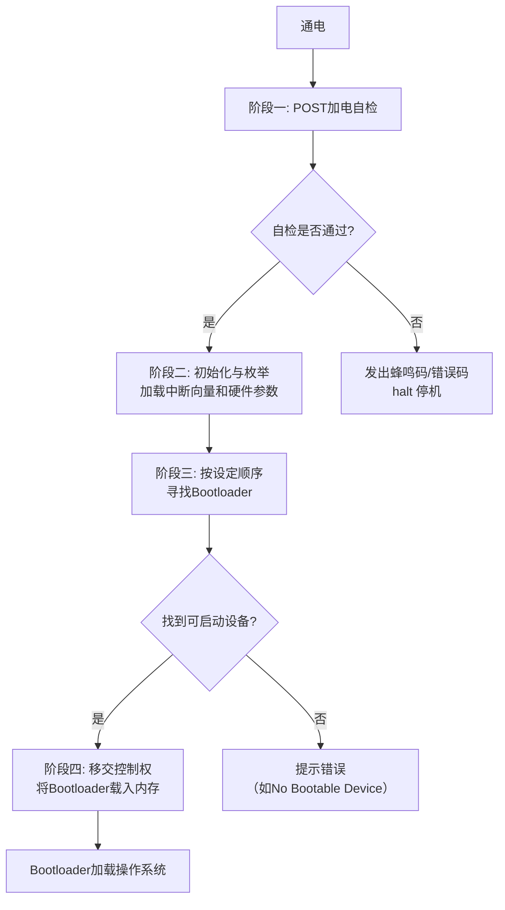

# BIOS

### BIOS 是什么？

**BIOS**（Basic Input/Output System，基本输入输出系统）是一段固化在计算机主板上一个芯片（通常称为 **BIOS 芯片**）中的**固件**（Firmware）。

你可以把它理解为计算机在通电后运行的**第一段软件程序**，是连接计算机硬件与操作系统的一座最基础的“桥梁”。它的主要使命就是“唤醒”硬件，并把控制权最终交给操作系统。

---

### BIOS 的物理载体

*   **BIOS 芯片**：一块小小的、可擦写的只读存储器（**EEPROM** 或 **Flash Memory**）。
*   **位置**：直接焊接或插槽安装在主板上。
*   **特点**：即使电脑断电，其内部存储的BIOS程序也不会丢失。我们可以通过“刷BIOS”来更新这个芯片里的程序。

好的，我们来对传统的 **BIOS** 进行一次更深入、更详细的剖析。

### BIOS 详解

#### 一、核心定义与物理形态

**BIOS**（Basic Input/Output System，基本输入输出系统）是预装在个人电脑主板上的**固件**。它是计算机硬件平台上最底层的软件，是硬件与操作系统之间的桥梁。

*   **物理载体**：一块安装在主板上的芯片，通常是 **EEPROM**（电可擦可编程只读存储器）或 **Flash Memory**（闪存）。这使得用户可以通过“刷BIOS”来更新固件程序，而无需更换硬件。
*   **非易失性**：即使电脑完全断电，BIOS程序也会持久保存在芯片中。
*   **位置**：位于主板上，通常靠近 **CMOS电池**（那个纽扣电池）和 South Bridge（南桥）芯片。

#### 二、BIOS 的四大核心功能

BIOS 的工作可以概括为四个核心阶段，其完整工作流程可总结为下图所示的四个阶段：

##### 1. 加电自检 (POST - Power-On Self-Test)
这是电脑通电后BIOS执行的第一个也是最重要的任务。它是一个硬件诊断过程，旨在确保所有关键硬件组件存在、就绪且功能正常。
*   **检测组件**：检查CPU、内存（RAM）、显卡、键盘、磁盘控制器等。
*   **错误处理**：
    *   **无声**：如果一切正常，你会听到一声短暂的“滴”声。
    *   **有声错误**：如果遇到致命错误，BIOS会通过主板扬声器发出一系列**蜂鸣码**。不同序列的“滴”声代表不同的硬件故障（例如，长响不停通常是内存错误）。
    *   **可视错误**：如果显卡初始化成功，但其他部件有问题，BIOS可能会在屏幕上显示**错误代码**或文本信息。

##### 2. 初始化与枚举
POST成功后，BIOS开始初始化并配置硬件。
*   **加载中断服务程序**：BIOS将其自身的一部分（即各种设备的中断处理程序）从ROM芯片复制到更快的系统内存（RAM）中。这些程序为操作系统提供了调用硬件基本功能的底层接口（例如，读写磁盘、屏幕输出、键盘输入）。
*   **生成系统配置表**：BIOS会检测并列出所有安装的硬件设备及其参数，形成一系列表格（如**MP Table** for Multi-Processor, **ACPI Table**），之后将这些表格的地址传递给操作系统。

##### 3. 引导程序 (Bootstrap Loader)
这是BIOS的最终目的：找到并加载操作系统。
*   **读取引导顺序**：BIOS按照用户预设的**引导顺序**，逐个检查设备（如硬盘、光驱、USB设备）。
*   **寻找主引导记录 (MBR)**：检查每个设备的第一个扇区（512字节），寻找特殊的**引导签名**（0x55AA）。
*   **加载MBR**：一旦找到，BIOS就将这个包含**引导代码**和**分区表**的MBR扇区加载到内存的特定位置（0x7C00）。
*   **移交控制权**：BIOS最后跳转到这个内存地址，将CPU的控制权完全交给刚刚加载的、极其微小的一段代码（Bootloader）。

##### 4. CMOS 设置 (BIOS Setup)
BIOS提供了一个用户可配置的界面，用于修改硬件设置。
*   **存储介质**：这些设置（如日期时间、引导顺序、硬件开关）并不存储在BIOS芯片本身，而是存储在一块单独的、由主板电池供电的**CMOS**（互补金属氧化物半导体）芯片中。这就是为什么拔掉主板电池可以“重置BIOS设置”。
*   **进入方式**：在POST过程中按特定键（如 `Del`, `F2`, `F10`）即可进入BIOS设置界面。

#### 三、BIOS 的局限性 (为何被 UEFI 取代)

尽管BIOS统治了PC市场数十年，但其设计源于16位处理器时代，存在诸多先天不足：

1.  **16位实模式**：BIOS运行在CPU的**16位实模式**下，无法直接访问超过1MB以上的内存空间。这导致其初始化现代硬件时效率低下且复杂。
2.  **MBR分区限制**：BIOS依赖的MBR分区方案最大只支持**2.2TB**的硬盘，且最多只能有**4个主分区**。
3.  **启动速度慢**：BIOS的初始化过程是顺序且单线程的，无法并行初始化硬件，导致启动速度较慢。
4.  **缺乏预启动环境**：BIOS本身缺乏一个高级的、功能丰富的预操作系统环境，不利于安全、网络恢复等高级功能的实现。
5.  **安全性弱**：BIOS几乎没有内置的安全机制来防止恶意软件在启动前（预启动阶段）感染系统，例如著名的 **Bootkit**  rootkit。

#### 四、BIOS 与 CMOS 的关系

这是一个常见的混淆点：
*   **BIOS**：是**固件程序**，存储在主板上的ROM芯片中。它包含了执行POST、初始化硬件和加载操作系统的代码。
*   **CMOS**：是一块**RAM芯片**，依靠主板电池供电，用于**存储BIOS程序的配置设置**（如日期、时间、启动顺序）。

**简单比喻**：
*   **BIOS** 就像是电脑的**基本操作系统**。
*   **CMOS** 就像是这个操作系统的**配置文件**或**注册表**。
*   **主板电池** 的作用就是保证CMOS芯片不断电，从而记住这些配置。

### 总结

传统BIOS是计算机启动过程中不可或缺的“引路人”。它完成了从冷启动到操作系统接管的整个底层准备工作。理解BIOS的工作机制，对于解决硬件故障、理解系统启动流程乃至计算机体系结构都至关重要。正是由于其上述的种种局限性，才催生了更现代、更强大的 **UEFI** 规范的出现和普及。
