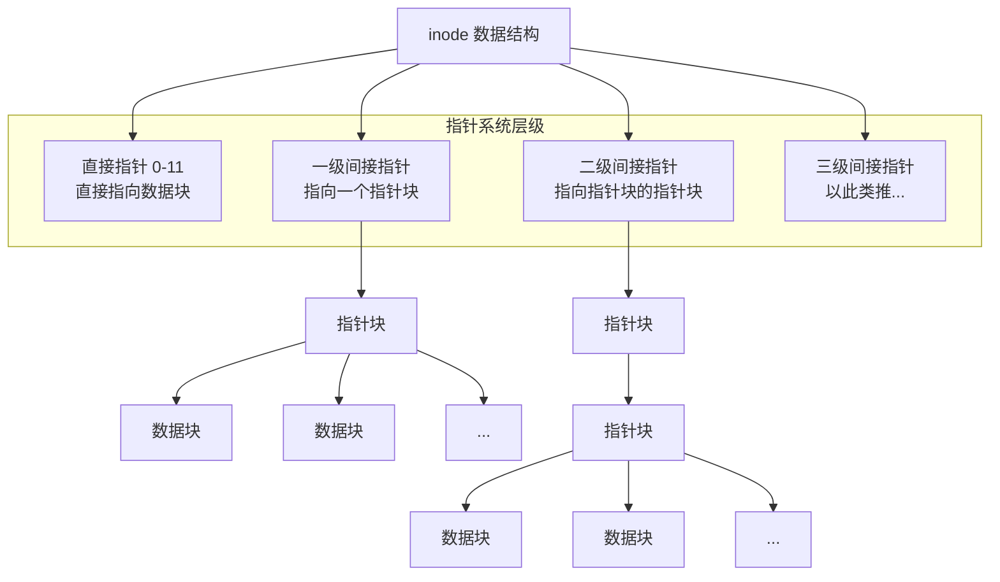

# Block和inode

## 数据块Block

**Block** 是文件系统上**存储实际数据内容的最小单位**。可以将整个硬盘想象成一个巨大的、由无数个固定大小的“储物柜”组成的仓库，每个“储物柜”就是一个 Block。


### 核心特性
*   **大小固定**：在创建文件系统（如使用 `mkfs.ext4`）时就被确定。常见的大小有 1KB, 2KB, 4KB。使用 `tune2fs -l /dev/sdX | grep "Block size"` 可以查看。
*   **地址唯一**：每个 Block 都有一个唯一的编号，称为**块地址**。文件系统通过这个地址来定位数据。
*   **存储内容**：Block 内部存储的是**文件的真实内容**——你的文本、图片的二进制数据、程序的机器码等。


### 工作方式

*   一个文件的大小几乎总是会超过一个 Block 的容量。因此，一个文件会占用**多个** Block。
*   这些 Block**不要求是连续的**。它们可以分散在硬盘的任何位置。文件系统负责记录和管理这些分散的块，并将它们组织成一个完整的文件呈现给用户。


## 索引节点inode

**inode** 是文件系统上一个**数据结构**，用于存储文件的**元数据**和**数据块指针**。可以把它想象成一个文件的**身份证**或**目录卡**。


### 标准大小

在大多数Linux文件系统（如ext2、ext3、ext4）中，**一个inode的大小通常是256字节**。这是一个比较常见且默认的值。在某些较早的系统或特定配置下，可能也会有**128字节**的inode。

可以通过以下命令查看已挂载文件系统的inode大小：

```bash
# 对于ext2/3/4文件系统，使用dumpe2fs命令。请将/dev/sda1替换为实际的分区设备
sudo dumpe2fs -h /dev/sda1 | grep "Inode size"
# 对于xfs文件系统，使用xfs_info命令
xfs_info /dev/sda1 | grep -i isize
```


### 构成部分

inode**存储了文件的元数据（metadata）**，但**唯独不包含文件名**。文件名实际上存储在目录文件中。

inode里面具体包含以下信息，可以通过 `stat` 命令查看某个文件的inode信息：

- **文件模式 (Mode)**：文件类型（普通文件、目录、符号链接等）和访问权限（读、写、执行）
- **所有者信息 (Owner)**：文件所有者的用户ID（UID）和组ID（GID）
- **文件大小 (Size)**：文件的字节数

- **时间戳 (Timestamps)**：包括最后访问时间（atime）、最后修改时间（mtime）、inode状态更改时间（ctime）
- **链接计数 (Links)**：指向此inode的硬链接数量
- **数据块指针 (Block Pointers)**：记录文件内容存储在硬盘上哪些块（block）中的指针，可能包含直接、间接、双重间接、三重间接指针


需要注意的是，每个部分占用空间的具体字节数**并非固定不变**，它取决于文件系统的具体实现和设计。不同类型的文件系统（如ext4, xfs, btrfs）可能会为了优化性能或增加功能而调整inode内部结构的分配。因此，我们通常更关注inode的**总大小**（256字节或128字节），而不是其中每一个字段的精确字节数。


### 关于inode大小的注意事项

*   **格式化时确定**：inode的大小和数量通常在**格式化磁盘创建文件系统时就确定了**，后续通常无法直接修改。
*   **空间占用**：inode本身会占用磁盘空间。文件系统会有一块专门的区域叫 **inode table** 来存放所有inode。
*   **用尽风险**：如果文件系统中存在大量非常小的文件，可能会**耗尽inode数量**（通过 `df -i` 命令查看），即使磁盘还有剩余空间，也无法创建新文件。


### inode编号

每个 inode 在它所在的文件系统内都有一个**唯一的编号**。操作系统和文件系统通过 inode 编号，而非文件名，来识别和操作文件。

使用 `ls -i` 命令可以查看文件的 inode 编号：

```bash
$ ls -i myfile.txt
1234567 myfile.txt  # 1234567 就是 inode 编号
```


### 指令

理解inode的大小和构成，能让你更清楚地看到Linux文件系统如何高效地管理文件和元数据。你可以使用 `dumpe2fs` 或 `xfs_info` 命令查看inode的实际大小，而 `stat` 命令则能帮你了解一个文件inode中的具体元信息。

希望这些信息对你有帮助。


## inode 如何与 Block 协同工作

这才是最精妙的部分。inode 和 Block 的关系，就像**一本书的目录**和**书的具体章节**。

*   **inode = 目录**：它本身不包含故事内容，但它告诉你故事的第 1 页、第 5 页、第 23 页...分别在什么地方。
*   **Block = 书页**：它们才是真正印有文字和图片的页面。


## inode 如何找到所有 Block？

inode 内部有一个精巧的“指针系统”来记录文件数据存储在哪些 Block 中。下图清晰地展示了这一多级指针寻址结构的工作原理：



## 总结与命令

| 特性     | **inode**                            | **Block**              |
| :------- | :----------------------------------- | :--------------------- |
| **目的** | 存储文件的**元数据**                 | 存储文件的**真实内容** |
| **内容** | 权限、所有者、时间戳、**数据块指针** | 文本、代码、图片数据等 |
| **命名** | 通过**编号**唯一标识                 | 通过**地址**唯一标识   |
| **大小** | 数量有限（可用 `df -i` 查看）        | 大小固定（如 4KB）     |
| **关系** | **书的目录**                         | **书的页面**           |

**相关命令：**

*   `ls -i`：查看文件的 inode 编号。
*   `df -i`：查看文件系统的 inode 使用情况。
*   `df -h`：查看文件系统的磁盘空间（Block）使用情况。
*   `sudo debugfs -R "stat <inode_number>" /dev/sdX`：查看某个 inode 的详细信息（包括它指向的块）。
*   `dumpe2fs /dev/sdX | grep -i "block size"`：查看文件系统的块大小。


